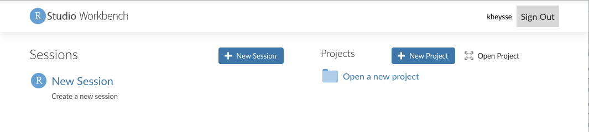
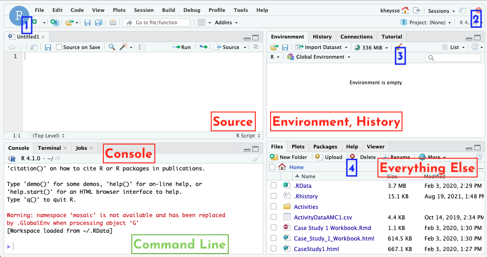

<!--# (PART) RStudio {-}-->

# R Studio Orientation

```{r, include=FALSE, warning=FALSE}
knitr::opts_chunk$set(echo = TRUE)
suppressPackageStartupMessages(library(mosaic))
```


In our class, we will be using RStudio, a developing environment commonly used for modeling and statistics. In real world mathematics, you will need to be able to work with data and apply your calculus concepts directly. That's what we'll do in RStudio, as it provides an excellent sandbox for us to play in. R (what RStudio is based on) is the programming language used by professional statisticians, so these skills will be useful no matter what field you go into!

However, just like any programming language, there is a startup cost. The learning curve for RStudio can be pretty steep, particularly if you've never done any coding before. Don't worry, that's where this guide comes in! In here you'll find all sorts of explanation and examples for some of the coding we'll be doing in (and out of) class. I promise, it'll be worth in the end, and you'll be a coding master.

## Getting Oriented

### First login
You'll get into RStudio via the url [https://rstudio.macalester.edu](https://rstudio.macalester.edu). It's linked in our Moodle page if you're feeling a little lazy. Your login is your Macalester username and password. You'll be given the following page (with your username in the uppper right corner):





I tend to ignore the projects and just activate a new session by clicking that panel.

### The RStudio window

Once you've got an active session, you'll be shown the following window. We'll talk about its parts, starting with the four panels you'll see. This picture is from a previous version of RStudio, but everything should work the same!





####  Panels
 
* Source: This is where you will edit RMarkdown notebooks, which are described much more in the RMarkdown section. 
* Console: This is RStudio's command line. It's a great place to test code and serves as a basic calculator.
* Environment, history: this panel keeps track of your work. The environment tab shows all the variables you have named in the session (including data, functions, and lists) and gives you a preview of them. The history tab tracks the pieces of code you run. 
* Everything else: this is where you'll find a lot of stuff, including the files you build and the plots you create of data/functions. It also has the packages list (described in the next subsection) and the help window, which can show you documentation of commands.


Now that we know what we're looking at, let's talk specifics. We'll talk a lot more about the source panel in the RMarkdown section.

#### Specific functions

* The new document button. This is how you'll make new files in your source window.
* The quit session button. Somtimes it's best to just start over if you can't figure out why something it not working. You'll be kicked back to that first page from the previous section.
* The clean environment button. Use this when you want to clear all you variables, including data sets.
* The files buttons. You'll use these to create, delete, and organize RMarkdown files and data files. See the data section for more information on how to upload data.


#### Command Line Console

The command line console is the most basic way to run code. It's great for simple calculations and to test out code before you run it. We'll run longer blocks of code in our notebooks. You can try out a few calculations here. 

**Notice!** Once you run a command (by pressing enter) it is gone to history. You don't go back and edit previous lines if you find a mistake. Instead, you run the command again with the fixed piece in a new line. Thankfully, RStudio makes this not so terrible. By pushing the UP button on your keyboard, you can scroll through previous commands that you've used.


### Packages

RStudio is open source, which means many people write packages to augment what it can do by default. Their work is our gain, and we'll need a few packages to be able to access what we want. In the lower right hand panel click on the packages tab. Then click on the check boxes next to the following packages:

* fetch: this package knows how to load in data files
* mosaic, mosaicCore, mosaicData: these contain the specific built-ins which create and plot functions for us. By checking the box by them, we import their functions into the session. Easy enough.
* mosaicCalc: Some of the function commands from the mosaic family of packages don't interact well with the built in derivative and antiderivative functions in RStudio. mosaicCalc fixes this
   * If you don't see mosaicCalc, then you need to download it. Run the following line of code in your console: `install.packages("mosaicCalc")` Once you do this, make sure that the mosaicCal box is checked in the packages list


## RMarkdown

In AMC1, we'll be working with code a lot: writing it, running it, analyzing it, and commenting on it. We'll also be going back to code we've already used and tweaking it to solve new but related questions. For all of these reasons, we're going to use RMarkdown notebooks. The notebook will run large chunks of code at a time and show the output right next to the code. It's also easier for you to comment on the code you've written and go back to it later. 

The best way to get working on this is to upload the template that I've put in the course Moodle page and just start experimenting with what's there. I'm sure you'll get it sorted!


<!--

## Calculations in RStudio

While RStudio is incredibly powerful, it has a lot of rules we need to follow about syntax. You will probably make a lot of mistakes with syntax when you start out (and probably after that, too) so it's helpful to know the ground rules and how to read error messages that come up.

### Basic Commands

#### Arithmetic
RStudio has a lot of built in functions that are pretty intuitive:
```{r}
2+3
4^3
sqrt(49)
```
Some of these functions, like `sqrt()`, take parameters (we put in 49). If you need help with a function, particularly if you need to know about how it takes its parameters, you can use the question mark in front of the function in the Console. Running this pulls up a help page in the lower right window about that function. The examples here are particularly useful!

Multiplication _always_ takes a `*` sign! For example, suppose I wanted to calculate $2\sin(\pi/2)$. We humans know that the two is multiplied on the sine function, but RStudio doesn't get it. 
```{r error=TRUE}
2 sin(pi/2)
```

We can fix this by including a multiplication sign between 2 and $\sin(\pi/2)$. 

```{r error=TRUE}
2 * sin(pi/2)
```

#### Exponentials and Logarithms
Another common error made regards the function $e^{x}$. RStudio instead uses the built in function exp:
```{r}
exp(1.7)
```
Here's how *not* to do this:

* `e^(1.7)`: R doesn't know what `e` means
* `exp^(1.7)`: You don't need the `^`
* `exp 1.7`: You do need the parentheses because `exp` is a function
```

Logarithms have a similar problem. The notation for the natural log in RStudio is `log()`, _not_ "ln". If you want to do $\log_{10}$, you use the command `log10`:

```{r}
log(100)
log10(100)
```

### Variables

Sometimes it's helpful to define a variable, particularly if we need to use it a lot. RStudio makes this easy.

```{r}
y=4
sin(3*y)
```

RStudio will keep track of your variables in the environment tab. If you want to delete all your variables, use the little broom icon. 

### Lists and sequences

Some of the calculations in AMC1 require a doing calculations over and over again to get an estimate of a value. A great way to do this is with a list or a sequence. It's also how we'll define coordinates for points. 

RStudio makes a list with the `c()` command. The "c" in short for "combine these values to make into a list".

```{r}
P=c(3,5,11,-1,4)
P
```

If you want to make a sequence, you use the `seq()` command. This takes the parameters

* `from`: where we start the sequence 
* `to`: where we want the sequence to end
* `by`: how large the step is.
So if I wanted a sequence 1, 1.1, 1.2, 1.3, etc... all the way up to 2, I would write

```{r, echo=TRUE}
S=seq(from=1, to=2, by=0.1)
S
```

Note that the default order of these parameters is `from,to,by` so you can also get this sequence with the shorter command

```{r, echo=TRUE}
S=seq(1, 2, 0.1)
S
```

**Pro Tips**:

* Always write `0.1` instead of `.1` in your code. It is much easier to read and to debug later!
* Consider adding a space after your commas to separate parameters. It's much easier to read later!


What's great about these lists is that you can do calculations to the whole list with only a few lines of code. For example, say I wanted to calculate 
$$f(x)=e^x-1+\sqrt{x}$$
for each of the points in my sequence `S`. I'll call those new values `T`:
```{r}
T=exp(S)-1+sqrt(S)
T
```
I use the sequence as my variable, and RStudio knows to calculate for each value in the sequence.

### Making functions

Suppose I asked you to calculate $f(3.2), f(3.3), f(3.33), f(3.339)$ for the function
\[f(x)=0.7 e^{2+x}-1.1\sin(x)-1\]

You could absolutely type this into RStudio by hand. I'll do the first one:

```{r}
0.7*exp(2+3.2)-1.1*sin(3.2)-1
```
This would get really old, though, particularly if I asked you to do it for four hundred points instead of four points. We'll build ourselves a function to do it instead! To do this, we'll employ the makeFun command:

```{r}
f=makeFun(0.7*exp(2+x)-1.1*sin(x)-1~x)
```
Much of this is pretty intuitive, except for maybe the final `~ x`. This tilde symbol comes up a lot in RStudio and it indicates *dependence*. We need to tell RStudio that $f$ is in terms of this variable $x$, so it knows where to put an input when I ask it to:

```{r}
f(3.2)
```

One of the main themes of this course is to generalize the work we do to many variables. We can also build multivariable functions with the same command, just changing the dependency a little bit. Suppose I want to code up $g(x,y)=\cos(xy)$:

```{r}
g=makeFun(cos(x*y)~x&y)
g(2,pi)
```
Notice the ampersand `&` in the dependency. Now my function depends on both $x$ and $y$. 

## Data

One of our jobs in AMC1 is tackling the challenges of working with real life data. This is where RStudio really shines. Math 155 will teach you a ton more on how to work with data in RStudio, so we'll just handle the basics here. This section talks about how to import data and work with it. For how to plot, head over to the plots section of this primer.

### Importing data from RStudio/mosaic

We use different code to import data depending on where we're calling it from. RStudio and the mosaic packages have lots of data sets built in that we can get at for our work. To do this, we use the fetchData command. We'll give our data set a variable name so we can easily reference it. 

```{r}
somedata = fetch::fetchData("stan-data.csv")
```
If you look over in your environment tab, this data set has now appeared. It's 222 observations of 2 variables. In that environments tab, you can look at the data by clicking on the small arrow (to see the first few entries) or the spreadsheet button (to open the file in the source panel). If you want to see the first bit of data in your console or your RMarkdown file, you can use the head command:

```{r}
head(somedata)
```

It looks like we've got some data about temperature over time. 

### Importing .csv files

Sometimes we will want to import our own data sets. The easiest way to do this is to have RStudio read it as a .csv file. Excel and other spreadsheet editors can export their files as .csv files, but we need to do some work to get it into our session. 


+ The first thing we need to do is upload the data set to our files. In the lower right panel, click on the files tab and then the upload button. You will be prompted to pick a file.
+ Once you have uploaded the file, it should appear in your files list. 
+ At the top of the environment/history tab, there is an import data set button. From that drop down menu, pick from csv. 
+ When the popup appears, click the browse button. You will be shown the files you have in your RStudio directory. Pick the one you just uploaded. 
+ Before you import it, you may want to change the name of the data set (in the lower left corner).
+ If you don't want to view your data after you import it, delete the view command from the code preview section (lower right of the popup). 
+ Hit import! You'll see your data set is listed in the environment tab.


## Plots 

One of the first things we learn about functions is that they can be represented with a graph. We can build the plot of a function with the appropriately named plotFun.

### Single variable plots

I like to build my functions with a makeFun command first, then we employ plotFun in a similar fashion.
```{r fig.align='center',fig.width=4.5, fig.height=2.5}
f=makeFun(3*x+2*sin(pi*x)~x)
plotFun(f(x)~x)
```

`plotFun` takes a whole variety of parameters, here are a few useful ones:

* `xlim`, `ylim`: sets the range of your $x$-axis. Example: `xlim=range(1,4), ylim=range(3,60)`
* `col`: sets the color of the function you plot. RStudio will recognize most basic colors, which you will pass as strings. Example: `col="red"`
* `add`: you'll use this when you want to add multiple functions to the same plot. We'll see an example of it below.
Example: `add=TRUE`
* `xlab`, `ylab`: for labeling your axes. You'll pass this as a string as well. Exanoke: `xlab="time", ylab="red=velocity, blue=position"`


Let's try some of this out. I broke the third line so it would all fit, you don't need to!

```{r fig.align='center',fig.width=4.5, fig.height=2.5, fig.show='hold'}
f=makeFun(x^3+3~x)
g=makeFun(3*x^2~x)
plotFun(f(x)~x, xlim=range(1,4), ylim=range(3,60), 
        col="blue",xlab="time", ylab="red=velocity, blue=position")
plotFun(g(x)~x, col="red", add=TRUE)
```

RStudio is a little weird about plots in the RMarkdown in that you might get multiples if you're adding plots together. If you want the chunk to hold all plots until the end, add `fig.show='hold'` into the script braces at the top of the chunk.

### Multivariable plots

Plotting multivariable functions in RStudio is very similar, but you'll have to sort through more parameters and decide how you want to look at your function. Let's start with what RStudio does as a default:

```{r fig.align='center',fig.width=5, fig.height=3}
g=makeFun(-x*y*exp(-x^2-y^2)~x&y)
plotFun(g(x,y)~x&y)
```

We are given quite a colorful plot! Since the function takes two variables, $x$ and $y$, we need some third way to display the output. That's what the colors and contours do. The colors show the relative values of the function (cooler colors for smaller values) while the contours connect all points $(x,y)$ that have the same function output. Again, this plotFun comes with parameters which can make a better picture. The ones from the single variable section still hold, so we'll list just the new ones here.

* `filled`: this determines whether you want the colors or not. Example: `filled=FALSE`
* `levels`: this tells RStudio about how you want the contours. You can only plot a few (as a list) or you can give it a *sequence*. RStudio takes a list by using the `c()` command, where the numbers are separated by commas. The sequence command systematically makes a list by starting from a number, going to a number, and incrementing by a certain amount. Exxample: `levels = c(3,4,5) or levels=seq(from=0, to=4, by=.5)`
* `surface`: sometimes (probably rarely) you may want to look at the actual three dimensional surface of the function. It's not great for estimating, but can help you get an overall idea of what the function is doing. 
Example: `surface=TRUE`


We'll try a little bit out:

```{r fig.align='center',fig.width=5, fig.height=3}
g=makeFun(-x*y*exp(-x^2-y^2)~x&y)
plotFun(g(x,y)~x&y, xlim=range(-1.5,1.5),
        ylim=range(-1.5,1.5), filled=FALSE, levels=seq(from=-.2,to=.2,by=0.05))
```

```{r fig.align="center", fig.width=4.5, fig.height=3.5}
f=makeFun(3*x^2-x-2*y^2+y-2~x&y)
plotFun(f(x,y)~x&y, surface=TRUE, xlim=range(-5,5), ylim=range(-5,5), zlab="f(x,y)")
```

### Plotting data

This is all great for nice, continuous, algebraic functions, but one of our jobs in AMC1 is to work with real life data. How do we plot that? Instead of the plotFun command, we'll use plotPoints. Recall from the lists and sequences section that we can define points with the commands `c()` or `seq()`. Suppose I want to plot the following points:

|     |      |      |      |      |      |
|-----|------|------|------|------|------|
| $x$ | -2.2 | -2.0 | -1.8 | -1.6 | -1.4 |
| $y$ |  6   |  4   |   2  |   0  | -2   |


 
```{r fig.align='center',fig.width=5, fig.height=3}
plotPoints(c(6,4,2,0,-2)~c(-2.2,-2.0,-1.8,-1.6,-1.4))
```

*Notice:* the $y$ coordinates go first! This is because we once again use the tilde to denote dependency. 

If you want to plot points from a data set, you'll use the same command with some alternate parameters. I'll use a previously loaded data set (unhelpfully) called somedata. It's got two variables, time and temp. Check back in the data section for details. 

```{r fig.align='center',fig.width=5, fig.height=3}
plotPoints(temp~time,data=somedata)
```

Cool, we've got our plot. Two things to note:

* We have again put our dependent variable first and our independent variable second using the dependency symbol `~`. 
* We need to put in the parameter data=somedata! Not doing so will result in an error, because RStudio does not know where to find these elusive variables time and temp. 

-->
