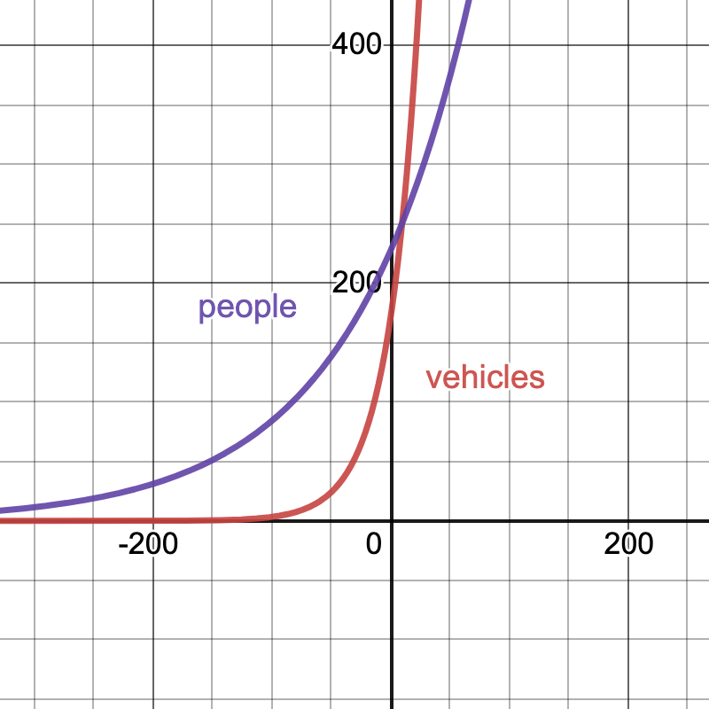

# Exponential and Logarithmic Functions


```{r, include=FALSE, warning=FALSE}
knitr::opts_chunk$set(echo = TRUE)
suppressPackageStartupMessages(library(mosaic))
```


## Goals

* Explain exponential functions in words, equations, and graphs
* Describe the effects of varying parameters in exponential functions
* Assess whether given data is exponential, and if so, model it
* Solve for unknowns in an exponent using the logarithm
* Write exponential functions in equivalent forms
* Determine half-lives and doubling times

## Activities

### Growing population

A population starts with $50,000$ organisms and grows by $6.7\%$ each year. Find an exponential model for the population.

### Consumer price index
The consumer price index (CPI) for a given year is the amount of money in that year that has the same purchasing power as \$100 in 1983. At the start of 2009, the CPI was 211. Write a formula for the CPI as a function of $t$ years after 2009, assuming the CPI increases by a rate of 2.8\% every year. 


### Two data sets
Here are approximate values of two functions. For each one, decide whether it could be a linear function or an exponential function. Give a reason and then find an approximate formula.

|    |    |    |    |    |    |    |    |
|----|----|----|----|----|----|----|----|
|   $x$  | 0 | 0.5 | 1 | 1.5 | 2 | 2.5 | 3 |
| $f(x)$ | 26.00 | 26.15 | 26.30 | 26.45 | 26.60 | 26.75 | 26.90 |
| $g(x)$ | 190 | 217 | 247 | 282 | 321 | 366  | 418


### Interest rate for an investment
Suppose that an investment triples in 15 years.

1. What is the interest rate $r$ if the interest is compounded annually: $I(t) = I_0 (1+r)^t$.
2. What is the interest rate $r$ if interest is compounded continuously: $I(t) = I_0 e^{rt}$.
3. Which rate is larger? Why does that make sense?


### Exponential decay
Radioactive cobalt-60 has a half-life of 5.3 years. If the initial amount is 60 grams, find a formula for the amount of cobalt-60 left after $t$ years. 


### Doubling time

The doubling time of an exponentially increasing function is the amount of time it takes for the quantity to double. Find the doubling time for the function $f(t) = 10 e^{1.2t}$.

### People and vehicles
In 1980, there were about 170 million vehicles (cars and trucks) and about 227 million people in the United States. The number of vehicles has been  growing at an annual rate of  4\% a year, while the population has been growing at an annual rate of 1\% a year. 

1. According to this model, when was there, on average, one vehicle per person? 

2. In desmos, make a plot of the number of vehicles and the number of people over time on the same graph with a different color for each curve.


3. Use your models to predict the number of vehicles and the number of people in 2020. Then use Google to see how accurate these models are over time.


## Solutions

### Growing population
.
$$ P(t) = 50000 (1.067)^t$$

### Consumer price index

$$C(t) = 211 (1.028)^t$$


### Two data sets
First, we note that the $x$ values are equally spaced. For $f(x)$, the value increases by $0.15$ for each entry, suggesting a linear function $f(x) = mx+b$. The slope is
$$
m=\frac{26.15-26}{20.5-20} = \frac{0.15}{0.2}=0.3.
$$
To find the vertical intercept, we plug in $x=0$ to find that $26 = 0.3 \cdot 0 + b$, so $b=26$.  Therefore, 
$$
f=0.3x+26.
$$
For $g(x)$, we note that each successive value is the previous one multiplied by approximately $1.14$. The points are evenly spaced so we have constant multiplicative change. This is an exponential function $g(x) = C a^t.$

We have $g(0) = 190 = C a^0 = C$, so $c=90$. Next, let's plug in any other point. We have
$g(0.5)=217=  190 a^(0.5) = 190 \sqrt{a}$ which means that $a = (217/190)^2=1.304$ So
$$ g(x) = 190 (1.304)^t.$$

### Interest rate for an investment
Our initial investment is $I_0$ and we have $I(15) = 3 I_0$.

1. For annual compounding, we have 
$$
\begin{array}{rcl}
3 I_0 &=& I_0 (1+r)^{15} \\
3  &=&  (1+r)^{15} \\
3^{1/15} &=& 1+r \\
\end{array}
$$
so $r = 3^{1/15} - 1 = 0.076.$

2. For continuous compounding, we have
$$
\begin{array}{rcl}
3 I_0 &=& I_0 e^{15r} \\
3  &=&  e^{15r} \\
\ln (3) &=& 15 r\\
\end{array}
$$
so $r = \ln(3)/15= 0.073$.

3. The rate for annual compounding is larger. That makes sense because the interest ``snowballs'' faster when you compound continuously.


### Exponential decay
Radioactive cobalt-60 has a half-life of 5.3 years. If the initial amount is 60 grams, find a formula for the amount of cobalt-60 left after $t$ years. 


Our function is $f(t) = P_0 a^t$ where $t$ is time in years, and $f(t)$ is the amount of colbalt-60 in grams. Since $60 = f(0) = P_0 a^0$, we know that $P_0 = 60$. Hence, $f(t) = 60 a^t$. Since The half life is 5.3 years, we know that
$$
\begin{array}{rcl}
30 & = & 60 a^{5.3}\\
\frac{30}{60} & = & a^{5.3} \\
\left( \frac{1}{2} \right) ^ {1/5.3} & = & a \\
0.877 & \approx & a.
\end{array}
$$
Therefore, $f(t) = 60(0.877)^t$.

### Doubling time

We want to solve $f(t)=20$ for $t$.
$$
\begin{array}{rcl}
20 & = & 10 e^{1.2t}\\
2 & = & e^{1.2t} \\
\ln(2) &=& 1.2 t
\end{array}
$$
so $t = \ln(2)/1.2 = 0.578$.


### People and vehicles

Our formulas are
$$
\begin{array}{rcl}
v(t) & = & 170(1.04)^t\\
p(t) & = & 227(1.01)^t.
\end{array}
$$
1. We want to solve
$$
\begin{array}{rcl}
v(t) & = & p(t) \\
170(1.04)^t & = & 227(1.01)^t \\
\left( \frac{1.04}{1.01} \right)^t & = & \frac{227}{170} \\
(1.0297) ^ t & = & 227/170 \\
t \ln (1.0297) & = & \ln (1.3353) \\
t & \approx & 9.87.
\end{array}
$$
Since $t$ is years since 1980, there will be one car per person in the year 1980 + 9.87 = 1989.87, that is, nearly 1990.


2. Here is a plot of the two functions.


{width=50%}

3. Our models predict
$$
\begin{array}{rcl}
v(40) & = & 170(1.04)^{40} \approx 816.17 \text{ million vehicles}\\
p(40) & = & 227(1.01)^{40} \approx 337.97 \text{ million vehicles.}
\end{array}
$$
Google says that in 2020, there were about 273.6 million vehicles  and 328.2 million people. So our model's predictions are not accurate.
