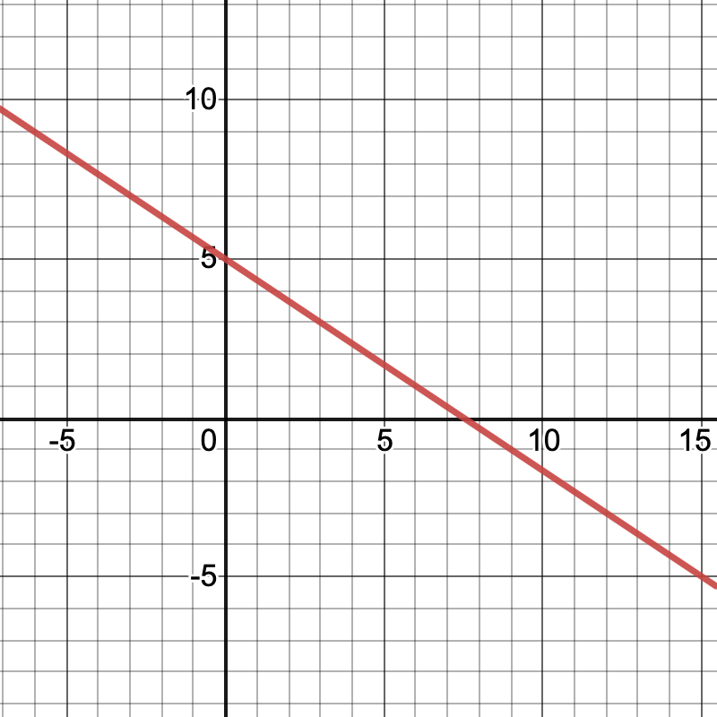

# Linear Functions


## Goals

 - Explain linear functions in words, tables, equations, and graphs
 - Describe the effects of varying parameters in linear functions
 - Assess whether given data is linear and, if so, model it with a function
 
## Linear Funtions

Here are three ways to write a linear function, depending on the information that you have. 

* Line with slope $m$ and vertical intercept $b$
$$y = mx + b$$
* Line with slope $m$ and containing point $(a,b)$
$$ (y-b) = m (x-a)$$
* Line that contains points $(a_1,b_1)$ and $(a_2,b_2)$
$$ (y-b_1) = \frac{b_2 - b_1}{a_2 - a_1} (x - a_1)$$

 
## Activities

### Graph of a linear function
Find the equation $y=mx+b$ for the graph shown below.

{width=50%}

### Height and weight of American men
The table below lists the average weight, $w$, in pounds of American men in their sixties for height, $h$, in inches.

**Height (inches)** | 68 | 69 | 70 | 71 | 72 | 73 | 74 | 75 
-------|-------|-------|-------|-------|-------|-------|-------|-------
**Weight (pounds)** | 166 | 171 | 176 | 181 | 186 | 191 | 196 | 201 

1. Which is the dependent variable and which is the independent variable?  
2. Is this an increasing function or a decreasing function?
3. Can this be represented by a linear function? If so, find an equation to describe this data.


### Scooter rates
A scooter company charges for monthly service according to the formula:
$$C(t) =  5.99 + 0.23 t$$ 
where $t$ is the number of minutes minutes ridden.

Find and interpret the rate of change and the vertical intercept.


### Oil reserves
There were 1650 billion barrels of proven oil reserves in the world as of 2016. At constant consumption levels (and excluding unproven reserves), the world had enough oil to last about 47 more years beyond 2016. 

1. Create a linear function $R(t)$ that models the oil reserves (in *billions* of barrels) where $t$ is the number of years since 2016. 
2. Find and interpret the rate of change and the vertical intercept of your function.

 


<!--
### World population growth rate
The plot below represents the world population growth rate by year since 1995. 

```{r}
Y=c(0,5,10,15,20)
R=c(1.41,1.26,1.20,1.13,1.06)
plotPoints(R~Y,main="World Population Growth Rate",xlab="Year (since 1995)",ylab="Growth Rate")
```

1. Explain why a linear model of this data is reasonable.
2. Come up with an equation that (approximately) describes this data.
3. What decision(s) did you make in part (b)? What are the strengths and weaknesses of your choice? 
4. Create a plot in RStudio that shows both the data points and the linear function that you found in part (b). 
      - Start by doing a cut-and-paste the R code above
      - You can add your linear function to this plot using `plotFun(m*t+b~t,add=TRUE)` where `m` and `b` are the slope and the vertical intercept of the function you found in part (b)
   
-->


## Solutions

### Graph of a linear function
The slope is
$$ m = \frac{-5 - 5}{15 - 0} = \frac{-10}{15}= - \frac{2}{3}$$
so the formula is 
$$ y = - \frac{2}{3} x + 5$$

### Height and weight of American men

1. Height is the independent variable (input) and weight is the dependent variable (output)
2. Increasing.
3. Yes because we have a constant rate of change. The slope is $\frac{171-166}{69-68}=5$ so the equation is
$$
w - 166 = 5 (h-68)
$$
which is the same as
$$
w = 5h - 174.
$$


### Scooter rates

* The vertical intercept is $\$5.99$. This is the monthly fee for the service.
* The rate of change is $0.23$ dollars per minutes. This is the "per minute" usage rate for riding a scooter.

Note that there is no "unlocking" fee in this plan. If there was an unlocking fee, then we would need a **second** input variable: the number of times that the scooter is ridden. 

### Oil reserves

1. We use all 1650 barrels in 47 years, so the slope is $-1650/47=-35.11$. The formula is
$$ B(t) =  - 35.11t+ 1650.$$

2. The rate of change is 35.11 billions of barrels per year. This is the annual consumption of oil. The vertical intercept os 1650 barrels. This is the amount of oil reserves in 2016.


