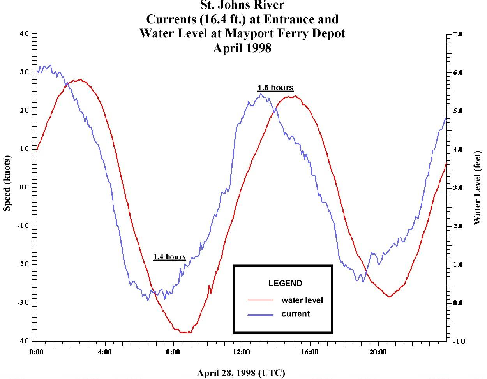

# Periodic Functions


```{r, include=FALSE, warning=FALSE}
knitr::opts_chunk$set(echo = TRUE)
suppressPackageStartupMessages(library(mosaic))
```

##  Goals

* Describe periodic phenomena using words, equations and graphs.
* Explain the effect of changing the four parameters of sine and cosine functions.
* Recognize and model periodic phenomena.


##  Activities

### Periodic function examples

Brainstorm at your table! Give four examples of periodic phenomena. Can you think of a periodic phenomenon that doesn't "look like" a sine function. (We've already seen one: the electrocardiagram pattern for a heartbeat),


### Find a periodic formula
For each graph shown, write down a corresponding periodic formula of the form $A \sin(\omega x) + C$ or $A \cos(\omega x) + C$.


<!--
1. 

```{r periodic2, echo=FALSE, out.width="75%"}
x <- seq(0,20*pi,0.01)
plot(x, -8 * cos(x/10), type='l', col='blue', xaxt='n',  ylab='y')
axis(side=1, at=c(0,5*pi, 10*pi, 15*pi, 20*pi), labels=c("0",expression(5*pi), expression(10*pi), expression(15*pi), expression(20*pi)))

```

-->

1.

```{r periodic4, echo=FALSE, out.width="75%"}
x <- seq(-2*pi,2*pi,0.01)
plot(x, cos(3*x)+2, type='l', col='blue', xaxt='n',  ylab='y')
axis(side=1, at=c(-2*pi, -pi, 0,pi, 2*pi),
     labels=c(expression(-2*pi), expression(-pi), "0",expression(pi), expression(2*pi)))
```


2.

```{r periodic1, echo=FALSE, out.width="75%"}
x <- seq(0,9,0.01)
plot(x, -7*sin(2*pi/3*x), type='l', col='blue', xaxt='n',  ylab='y')
axis(side=1, at=c(0,2,4,6,8,10), labels=c(0,2,4,6,8,10))

```


<!--
3.

```{r periodic3, echo=FALSE, out.width="75%"}
x <- seq(0,pi,0.01)
plot(x, -40*sin(2*x)+50, type='l', col='blue', xaxt='n',  ylab='y')
axis(side=1, at=c(0,pi/2, pi), labels=c("0",expression(pi/2), expression(pi)))

```
-->

### Variable star

Mira is a red giant star in the constellation Cetus. Its brightness (as seen from Earth) fluctuates as it expands and contracts. The apparent magnitude ranges from a maximum of 10th magnitude to a minimum of 2nd magnitude. This apparent brightness has a period of 332 days.

Find a formula that models the brightness of Mira as a function of time, with $t=0$ at peak brightness.

### Tides and currents

 Here is a plot of the water level (in red) and the current speed (in blue) of the St. Johns River. Each of them go through two cycles in 24.83 hours. This is the length of one **lunar day**: the time it takes for a point on the Earth to rotate from an exact point under the Moon to that same point under the Moon. (This is slightly longer than one day because the Moon revolves around the Earth in the same direction as the Earth's rotation.) So you can assume that the period for each is 12.415 hours.

Model the water level $w(t)$ and the current speed $c(t)$ using periodic functions, where $t$ is the number of hours since midnight April 28, 1998. 

* Be sure to use the appropriate vertical axis for each one!
* Decide which one will be easier to model: $w(t)$ or $c(t)$? Do that one first, and then adjust that function to get the other one.

{width=80%}

Image Source: https://tidesandcurrents.noaa.gov/


<!--   actually take 25 hour cycle!!!  Unlike a 24-hour solar day, a lunar day lasts 24 hours and 50 minutes. This occurs because the moon revolves around the Earth in the same direction that the Earth is rotating on its axis  -->

### Rainfall in Seattle

Here is the average rainfall in Seattle.

**Month**   | Jan | Feb | Mar | Apr | May | Jun | Jul | Aug | Sep | Oct | Nov | Dec 
-------|-------|-------|-------|-------|-------|-------|-------|-------|-------|-------|-------|-------
**Rainfall** (inches) | 5.1 | 3.9 | 4 | 2.8 | 1.9 | 1.5 | 0.9 | 1.2 | 1.9 | 3.2 | 5.4 |  6.1

Model the monthly rainfall with a periodic function $r(t)$ where $t=0$ corresponds to January. Your function must attain its maximum in December, so you will need a horizontal shift!

<!--
## Solutions


### Periodic function examples

There are lots of period functions. How about:

* The average monthly temperature in St Paul. The period of this function is one year, and it looks a lot like a sine function.
* The traffic on I-94. The period of this function is one week.
* The number of students in our classrrom. The period of this function is one week.
* The percentage of the moon that is illuminated. The period of this function is one lunar month.

### Find a periodic formula


1. The function is $\cos\left(3x \right)+1$


2. The function is $-6 \sin\left(\frac{2\pi}{3} \right)$


### Variable star

The amplitude is $(10-2)/2=4$ and the vertical shift is $(10+2)/2=6$. The period is 332 days, so our formula is
$$ 4 \cos \left( \frac{2 \pi}{335} t\right).$$

### Tides and currents


The current speed uses the vertical axis on the left. The maximum is 3 and the minimum is -3. So the amplitude is 3 and there is no vertical shift. The maximuum is achieved at $t=0$, so we can just use a cosine curve:
$$
c(t) = 3 \cos \left( \frac{2 \pi}{12.415} t \right)
$$

The water level is modeled by a cosine curve *shifted to the right*. The water level has amplitude $(5.5 - (-0.5))/2) = 6/2=3$ and vertical shift $(5.5 + (-0.5))/2) = 3$. The period is $12.415$ hours, and we must shift to the right by one fourth of that amount, so $\phi=-12.415/4 \approx  -3.1$. So
$$ w(t) = 3 \cos \left( \frac{2 \pi}{12.415} ( t - 3.1) \right)  +3$$


### Rainfall in Seattle

The amplitude is about $5/2=2.5$ and the vertical shift is $7/2=3.5$. The period is 12 months. We reach our peak in December, so we must shift a cosine curve to the left by $\phi=1$ unit. So our function is
$$ r(t) = 2.5 \cos \left( \frac{2\pi}{12} ( t + 1) \right) + 3.5.$$

-->
