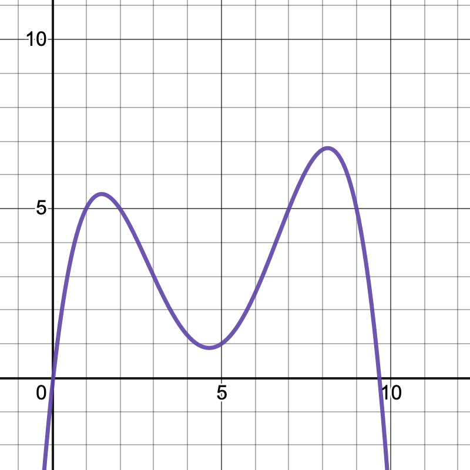
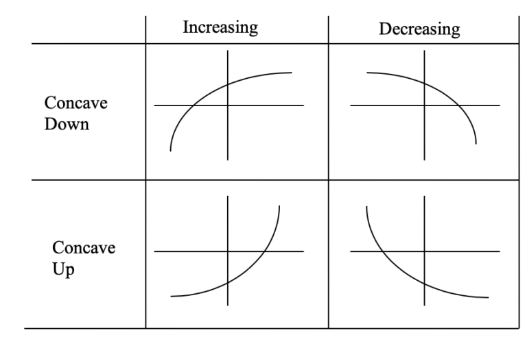

# Average Rate of Change

## Goals

 - Calculate average rate of change (AROC) on an interval
 - Recognize when a function is increasing or decreasing
 - Recognize when a function is concave up or concave down
 

## Activities

### AROC of a function

Find the average rate of change (AROC) of the function $f(x) = 2x^2 -3x + 1$ on the interval between $x=-1$ and $x=3$. 

### Measuring daily rainfall
One rainy summer day, hourly measurements of the total rainfall were recorded (in inches) by a rain gauge. 

**Time**   | 8 am | 9 | 10 | 11 | noon | 1 pm | 2 | 3 | 4 | 5 pm
-------|-------|-------|-------|-------|-------|-------|-------|-------|-------|-------
**Amount** | 0.15 | 0.17 | 0.2 | 0.45 | 0.48 | 0.75 | 1.03 | 1.20 | 1.45 | 1.60

1. What was the average rate of rainfall from 8 a.m. to 5 p.m.? 
2. What are the units of this rate of change? 

### Sketching a function

1. Sketch a *nonlinear* function that has an average rate of change of 1 on the interval $[0,2]$.
2. Compare sketches at your table. Are they similar?
3. Sketch a function with an AROC of 1 on $[0,2]$ that is *very different* from everyone else's function.

**The take away:** AROC is an estimation of the behavior of the function on the interval. But there is no guarantee about the quality of the estimate.

### Slope and Concavity
Sketch an example of a function that is

1. Increasing and concave up
2. Increasing and concave down
3. Decreasing and concave up
4. Decreasing and concave down

### Example Function
Here is the graph of a function.
{width=50%}

Find the subintervals of $[0,10]$ where the function is

1. Increasing
2. Decreasing
3. Concave up
4. Concave down

<!-- y=\frac{-\left(x-1\right)\left(\frac{x}{3}-3\right)\left(x-7\right)\left(x-2\right)}{8}+5 -->

### Vinyl LPs

Let $V(t)$ denote the number of vinyl LP records sold in the US (in millions) in year $t$.

$$
\begin{array}{c|c|c|c|c|c|c}
t & 1995 & 2000 & 2005 & 2010 & 2015 & 2020 \\
\hline
V(t) & 0.8 & 1.5 & 0.9 & 2.8 & 11.9 & 27.5
\end{array}
$$

1. Calculate the average rate of change for each of the five year intervals 1995-2000, 2000-2005, 2005-2010, 2010-15, 2015-2020.
2. Use your answers from part 1 to determine whether the function $V(t)$ is increasing or decreasing on these five year intervals.
3. Use your answers from part 1 to estimate whether the function $V(t)$ is concave up or concave down at each of the points 2000, 2005, 2010  and 2015.

### Relative change of the Dow Jones average 
The *relative change* of a function $f(x)$ on interval $[a,b]$ is
$$ \frac{f(b)-f(a)}{f(a)}.$$

1. What is the *relative change* in the Dow Jones average from 169.84 to 77.90 (from 1 January 1931 to 31 December 1931)? 
2. Compare this to the *relative change* in the Dow Jones average from 35,443.82 to 35369.09 (from 2 September 2021 to 3 September 2021).

## Solutions

### AROC of a function

$$
\frac{f(3)-f(-1)}{3- (-1)} = \frac{10-6}{3+1} = \frac{4}{4}=1
$$

### Measuring daily rainfall

1. The rate of change is 
$$\frac{1.60 - 0.15}{9} = \frac{1.45}{9} = 0.16$$
2. The units are inches per hour.

### Sketching a function

Here are three very different functions that all have an average rate of change of 1 on the interval $[0,2]$. 

**The take away:** AROC is an estimation of the behavior of the function on the interval. But there is no guarantee about the quality of the estimate.

{width=50%}

### Slope and Concavity

{width=50%}

### Example Function
1. Increasing on $(-\infty,1.5)$ and $(4.6,8.1)$ 
2. Decreasing on $(1.5,4.6)$ and $(8.1,\infty)$ 
3. Concave up on $(3,6.5)$ 
4. Concave down on $(-\infty,3)$ and $(6.5,\infty)$ 

### Vinyl LPs

1. Here are the AROC for the intervals:
$$
\begin{array}{c|c|c|c|c|c|c}
\mbox{interval} & 1995-2000 & 2000-2005 & 2005-2010 & 2010-2015 & 2015-2020 \\
\hline
\mbox{AROC} & 0.14 & -0.12 & 0.38& 1.82 & 3.12 & 
\end{array}
$$

2. The function appears to be decreasing on $2000-2005$ and increasing on the other intervals.
3. The function appears to concave down at 2000 because the slope "gets more negative" at this point. It appears to be concave up at the other points because the slope "gets more positive." 

### Relative change of the Dow Jones average 

1. The relative change is
$$ \frac{77.90-169.84}{169.84}=-0.541,$$
2. The relative change is 
$$\frac{35369.09-35443.82}{35443.82}=-0.002.$$

