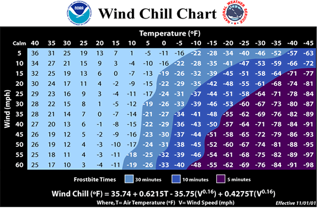
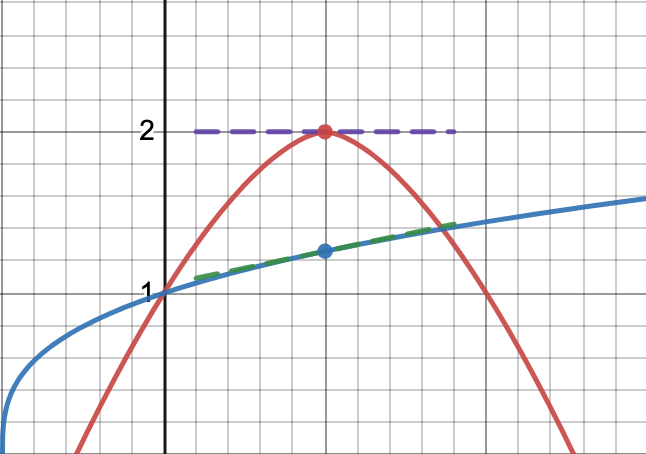

# Local Linear Approximation


```{r, include=FALSE, warning=FALSE}
knitr::opts_chunk$set(echo = TRUE)
suppressPackageStartupMessages(library(mosaic))
suppressPackageStartupMessages(library(mosaicCalc))
```

The linearization of $f(x)$ at $x=a$ is
$$
L_a(x) = f(a) + f'(a) (x-a).
$$


The linearization of $f(x,y)$ at point $(a,b)$ is
$$
L_{(a,b)}(x,y) = f(a,b) + f_x(a,b) (x-a) + f_y(a,b) (x-b).
$$


## Activities

### Estimating Sugar Solution Temperature

 
We are boiling a sugar solution to make salt water taffy. When we start, the temperature of the solution is $80^\circ$F, after 5 minutes it's $115^\circ$F, and after 10 minutes it's $165^\circ$F. 

1. Estimate the temperature after 17 minutes.
1. The sugar solution needs to reach $289^\circ$F to be the consistancy of taffy. Estimate when this will happen.

### Comparing Linearizations

1. Draw two (nonlinear) functions $f(x)$ and $g(x)$ and their linearizations at $x=1$. One function should be "well estimated" by the linearization around $x=1$ and the other should be "poorly estimated" by the linearization around $x=1$. 
2. What feature(s) of the curve $y=f(x)$ result in a good approximation?
2. What feature(s) of the curve $y=g(x)$ result in a bad approximation?

### Estimating a Function

1. Find the linearization $L_2(x)$ the function $g(t)=t^3+e^t-4$.    
   * Remember that $L_2(x)$ means "the local linear approximation at $x=2$."  
   * You will need to use desmos to approximate $f'(2)$.

2. Use your formula for $L_2(x)$ to estimate $g(2.1)$, $g(1.98)$, $g(3)$ and $g(0.7)$. 

3. Check your estimations with the original function.
  
4. What do you notice about your approximations as you get further from the spot where you built the linearization?


### Estimating the Windchill

We've  talked about windchill $w(t,v)$ as a function of temperature $t$ and wind speed $v$. Here is the table that we've used

{width=100%}

1. The perceived temperature when $t=-10 ^\circ$F and $v=40$ mph is $w(-10,40)=-43$. I have used desmos to estimate that
$$
w_t(-10,-40) = 1.39, \qquad w_v(-10,40)= −0.28.
$$
Use these values to find the linearization $L_{(-10,40)}(t,v)$ at the point $(-10,40)$.

2. Use your linearization (and desmos!) to estimate the four windchill values $w(-5,40)$, $w(-15,40)$, $w(-10,45)$ and $w(-10,35)$. Are your estimates close to the actual values? 


3. Find the linearization of $w(t,v)$ at $t=-10$ and $v=40$ using the 
the partial derivatives of the formula $w(t,v) = 35.74+0.6215 t-35.75 v^{0.16}+0.4275 t \, v^{0.16}$. Here is a [link to my desmos calculator for the partial derivatives of this function. ](https://www.desmos.com/calculator/dvuhpknthj)
   

## Solutions


### Estimating Sugar Solution Temperature

1. Let's use $f(t)$ to denote the temperature.We need to estimate the rate of change at $t=10$. We have
$$ f'(10) \approx \frac{165 - 115}{10-5} = \frac{50}{5}=10$$.
We use the linear approximation
$$L_{10}(t) = 165 + 10 (t-10)$$
to estimate the temperature. We have
$$f(17) \approx L_{10}(17) = 165 + 10 (17-10) = 235.$$


2. We must solve
$$ 289 = 165 + 10 (t-10) = 65t$$
to find that $10t = 224$ and so $t=22.4$ minutes.


### Comparing Linearizations

1. In the graph below, the blue function is well estimated by its tangent line, while the red function is not.

{width=30%}

2. If the curve has low concavity near the point $x=a$ then the tangent line is a good approximation. In other words, the second derivative remains near zero around the point $x=a$
2. If the curve has a lot of concavity near the point $x=a$ then then tangent line is not a good approximation. This is because the curve bends away from the tangent line.

### Estimating a Function

1. Using desmos, I found that $f(2)=11.39$ and $f'(2)=19.39$. Therefore
$$ L_2(t) = 11.39 + 19.39 ( t-2).$$

2. I get the estimates $g(2.1) \approx 13.33$, $g(1.98) \approx 11.00$, $g(3) \approx 30.78$ and $g(0.7) \approx -13.82$. 

3. The true values are $g(2.1) = 13.43$, $g(1.98) = 11.01$, $g(3) = 43.09$ and $g(0.7) \approx -1.64$.. 
  
4. The approximations close to $t=2$ are much better!


### Estimating the Windchill

1. $L_{(-10,40)}(t,v) = -43 + 1.39(t+10) -0.24(v-40)$

2. My estimates are  $w(-5,40) \approx -36.05$, $w(-15,40) \approx -49.95$, $w(-10,45) \approx 41.8$ and $w(-10,35) \approx -44.2$. These are pretty close to the values on the table.


3. Using the function and the partial derivatives from [this desmos calculation](https://www.desmos.com/calculator/dvuhpknthj), we get
$$
L_{(-10,40)}(t,v) = -42.70 + 1.39(t+10) -0.29(v-40)
$$

