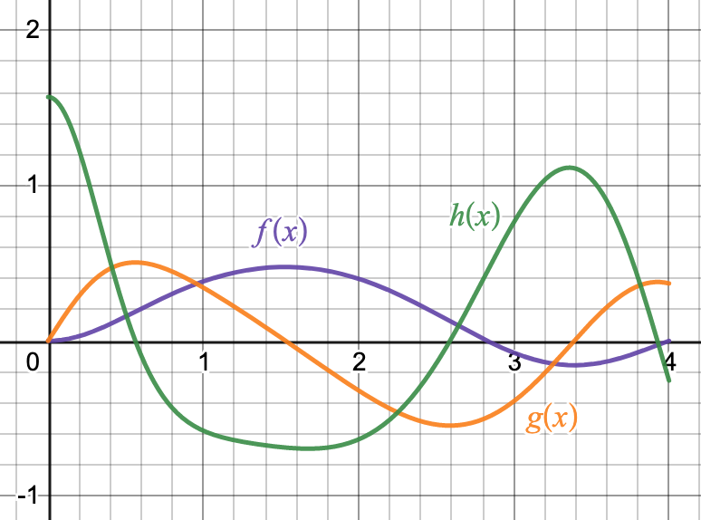

# The Second Derivative


```{r, include=FALSE, warning=FALSE}
knitr::opts_chunk$set(echo = TRUE)
suppressPackageStartupMessages(library(mosaic))
suppressPackageStartupMessages(library(mosaicCalc))
```

## Interpreting the First and Second Derivative

The First Derivative

* $f'(c) > 0$ means that the function is **increasing** at $x=c$
* $f'(c) < 0$ means that the function is **decreasing** at $x=c$
* if $f'(c) = 0$ then $x=c$ might be a local minimum or a local maximum

The Second Derivative

* $f''(c) > 0$ means that the function is **concave up** at $x=c$
* $f''(c) < 0$ means that the function is **concave down** at $x=c$
* if $f'(c) = 0$ then $x=c$ might be a point of inflection

## Activities

### Estimating the first and second derivatives from a graph

Here is a plot of the function $f(x)$.
```{r, echo=FALSE}

plotFun(10 * (x-1)*(x-2)*(x)*(x+1) /(exp(x^2)+1)~x, xlim=c(0,3), ylab = "f(x)")

```

1. Estimate the intervals on which the derivative $f'(x)$ is positive and the intervals on which the derivative $f'(x)$ is negative
1. Estimate the intervals on which the second derivative $f''(x)$ is positive and the intervals on which the second derivative $f''(x)$ is negative

### Function Matching

Three curves $f(x), g(x), h(x)$ are plotted below. These curves are actually a function, its derivative, and its second derivative. Which is which? How do you know?

<!-- 2\ \frac{\sin\left(\pi\ \frac{x^{2}}{8}\right)}{1+x^{2}} -->

{width=75%}

### A Plot of Velocity

Recall that displacement $x(t)$, velocity $v(t)$ and acceleration $a(t)$ are related by the equations

$$  v = \frac{\partial x}{\partial t} \quad \mbox{and} \quad a = \frac{\partial v}{\partial t} = \frac{\partial^2 x}{\partial t^2}.$$
Here is a plot of **velocity** $v(t)$ of an object.


```{r, echo=FALSE}
plotFun(sqrt(x) * sin( pi * x)~x, xlim=c(0,2), xlab='t', ylab='v(t)')

```

Identify the time interval(s) where:

1. The object has positive acceleration.
1. The position of the object is increasing.

### Characterize the Derivatives

Each of the scenarios below describes a quantity that is changing over time. For each one,  (a) determine whether the first derivative is positive, negative or zero and (b) determine whether the second derivative is positive, negative or zero.

1. The number of views of a video that is going viral.
2. The altitude of a bird that is about to have a gentle landing on the ground.
3. The location of a car that is cruising at the speed limit on a straight highway.


## Solutions

### Estimating the first and second derivatives from a graph

1. The first derivative is positive when the function is increasing. The first derivative is negative when the function is decreasing. 
  * $f'(x)>0$ on $[0,0.4]$ and $[1.4,2.3]$
  * $f'(x)<0$ on $[0.4,1.4]$ and $[2.3,3]$
2. The second derivative is positive when the function is concave up. The second derivative is negative when the function is concave down.
  * $f''(x)>0$ on $[0.9,1.75]$
  * $f''(x)<0$ on $[0,0.9]$ and $[1.75,3]$
  
### Function Matching

The function $g(x)$ is the derivative of $f(x)$. This is because $f(x)$ is increasing if and only if $g(x)$ is positive.

Similarly, the function $h(x)$ is the derivative of $g(x)$. 

So we have $g(x)=f'(x)$ and $h(x) = f''(x)$.

### A Plot of Velocity

1. Since the plot shows **velocity**, its derivative is the **acceleration**. So we have positive acceleration when the graph is increasing. This is true on $[0,0.6]$ and $[1.55,2]$.
2. The position of the object is increasing whenever the velocity is positive. The graph is above the $x$-axis on $[0,0.9]$.

### Characterize the Derivatives

1. Both the first and second derivatives are positive. The number of views is increasing at a faster and faster rate.
2. The first derivative is negative because the height of the bird is decreasing. The second derivative is positive because the bird is slowing down as it approaches the ground.
3. The first derivative is positive since the car is moving forward. The second derivative is zero because the velocity is not changing.
