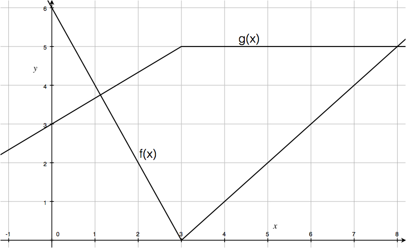

# The Chain Rule

## Activities

### Chain Rule Practice

Find the derivative for each of the following functions.

1. $g(z)=(z^2+5)^3$
1. $g(m) = 200 e^{0.12m}$
1. $h(x) = e^{5x^2+1}$
1. $g(x) = \sqrt{1+x^3}$
1. $f(t) = \cos(2t^3+5t^2)$
1. $k(x) = \ln(4x^2)$

### More Chain Rule Practice

Find the derivative for each of the following functions.

1. $f(x)=\sin(2x)$
1. $P(t)=e^{2t}$
1. $y(x)=x e^{3x}$
1. $f(z)=\ln(z^2+1)$
1. $R(t)=(\sin t)^5$
1. $f(t)=\sin \sqrt{e^{t}+1}$
1. $g(y)=e^{2e^{y^3}}$

### Conceptual Chain Rule Problems 

1. The amount of gasoline $G$, in gallons, used by a car is a function of the distance traveled $s$, in miles. The distance traveled $s$ depends on the time $t$, in hours, spent driving. 
If the rate at which gas is consumed is 0.06 gallons per mile, and if the car is traveling at 40 miles per hour, how fast is the gas being used?
1. The radius of a circular oil spill is increasing at a rate of 2 meters per minute. Find how fast the area is changing when $r=50$ meters

### Visual Chain Rule Problem

Below are the graphs of two functions, $f(x)$ and $g(x)$. Use the chain rule to calculate the derivatives specified below

{width=70%}

1. $(f(g(x))'$ when $x=3$. 
2. $(g(f(x)))'$ when $x=1$. 
3. $(g(f(x)))'$ when $x=2$.

## Solutions

### Chain Rule Practice

1. $g'(z) = 3(z^2+5)^2\cdot 2z$
1. $g'(m) = 200 \cdot 0.12 \cdot e^{0.12m}$
1. $h'(x) = e^{5x^2+1}\cdot (10x)$
1. $g'(x) = \frac{1}{2}(1+x^3)^{-1/2}\cdot(3x^2)$
1. $f'(t) = -\sin(2t^3+5t^2)\cdot(6t^2+10t)$
1. $k'(x) = \frac{1}{4x^2}\cdot 8x$

### More Chain Rule Practice

1. $f'(x) = 2\cos(2x)$
1. $P'(t) = 2e^{2t}$
1. $y'(x) = e^{3x} + 3xe^{3x}$
1. $f'(z) = \frac{2z}{z^2+1}$
1. $R'(t) = 5 (\sin t)^4 \cdot \cos t$
1. $f'(t) = \cos \sqrt{e^{t}+1} \cdot \frac{1}{2}\left(e^{t}+1\right)^{-1/2}\cdot e^{t}$
1. $g'(y) = e^{2e^{y^3}} \cdot 2e^{y^3}\cdot 3y^2$

### Conceptual Chain Rule Problems 

1. The amount of gasoline $G$, in gallons, used by a car is a function of the distance traveled $s$, in miles. The distance traveled $s$ depends on the time $t$, in hours, spent driving. 
If the rate at which gas is consumed is 0.06 gallons per mile, and if the car is traveling at 40 miles per hour, how fast is the gas being used?

We have a gasoline function $G(s)$ for distance $s$, and a distance function $s(t)$ for time $t$. We have
$$
\frac{d G}{ds} \cdot \frac{ds}{dt} = \left( 0.06 \, \frac{\mbox{gallons}}{\mbox{mile}} \right) \left( 40 \, \frac{\mbox{miles}}{\mbox{hour}} \right)
= 2.4 \, \frac{\mbox{gallons}}{\mbox{hour}}
$$

2. The radius of a circular oil spill is increasing at a rate of 2 meters per minute. Find how fast the area is changing when $r=50$ meters?

We have area $A(r)=\pi^{r^2}$, so $\frac{dA}{dr} = 2\pi r$. When $r=50$, this rate of change is $100 \pi$ meters/minute. Therefore
$$
\frac{d A}{dr} \cdot \frac{dr}{dt} = \left( 100 \pi \, \frac{\mbox{m}^2}{\mbox{m}} \right) \left( 2 \, \frac{\mbox{m}}{\mbox{min}} \right)
= 200\pi \, \frac{\mbox{m}^2}{\mbox{min}}
$$
Aside: It's really interesting that the rate of change of the area (with respect to radius $r$) is $2\pi r$, which is the circumference of the circle! This make a lot of sense: the circumference is the boundary of the area, so its expansion captures the expansion of the area.

### Visual Chain Rule Problem

1. We want $(f'(g(3)) g'(3)$. We have $g(3)=5$ and $f'(5)=1$. However $g'(3)$ is not defined because $x=3$ is a cusp point for $g(x)$. So the derivative of $f(g(x))$ does not exist at $x=3$.

2. We want $(g'(f(1)) f'(1)$.  We have $f(1)=4$ and $g'(4)=0$ and $f'(1)=-2$. So our answer is 
$$(g'(f(1)) f'(1) = g'(4) f'(1) = 0.$$
3. We want $(g'(f(2)) f'(2)$. We have $f(2)=2$ and $g'(2)=2/3$ and $f'(2)=-2$. So our answer is 
$$(g'(f(2)) f'(2) = \frac{2}{3} \cdot (-2) = -\frac{4}{3}.$$

