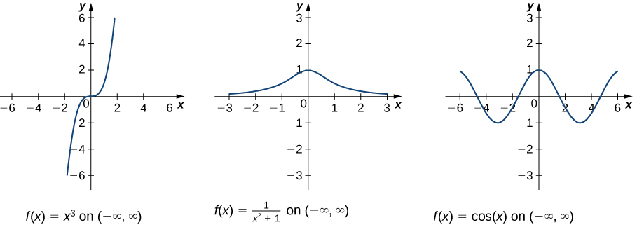
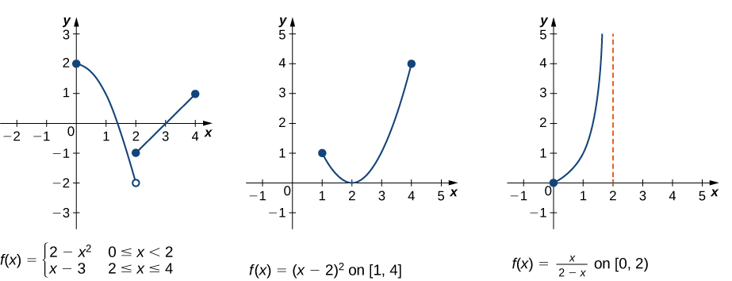

# (PART) Optimization {-}

# 1D Optimization

## Activities

### Characterize the Extrema

1. Each of the functions below is defined on $(-\infty, \infty)$. Find all the local extrema and global extrema. 

{width=100%}

image: https://openstax.org/books/calculus-volume-1/pages/4-3-maxima-and-minima

2. Each of the functions below is defined on a finite interval. Find all the local extrema and global extrema. 

{width=100%}
image: https://openstax.org/books/calculus-volume-1/pages/4-3-maxima-and-minima

### First Derivative Test

Find the critical point(s) of the following functions. Then use the first derivative test to determine whether it is a local minimum, a local maximum, or neither

1. $f(x) = x - e^x$
1. $g(x) = x + \sin(x)$ on $[0,2\pi]$

### Second Derivative Test

The function $f(x) = x^4-8 x^3+22 x^2-24 x$ has critical points at $x=1$ and $x=2$ and $x=3$.

1. Find $f''(x)$.
2. Use the second derivative test to determine whether each of the critical points is a minimum or a maximum.

### Cupcake Store

A cupcake store finds that at a price of \$4.00, the demand is 400 cupcakes. For every \$.25 decrease in price, the demand increases by 20 cupcakes. 

1. Define a function $q(x)$ that gives the demand for cupcakes at a price of $x$ dollars.
2. The revenue for a price of $x$ dollars is $r(x) = x \cdot q(x)$. Use your function from part (a) to find the price that maximizes revenue.

Find the price and quantity that maximize the revenue.

## Solutions

### Characterize the Extrema

1. We have three different functions
  * $f(x) = x^3$ has no extrema
  * $f(x) = \frac{1}{x^2+1}$ has a global maximum at $x=1$
  * $f(x) = \cos(x)$ has global maxima at $x=2k \pi$ for every integer $k$. It has global minima at $x=(2k+1) \pi$ for every integer $k$.

2. Once again we have three functions
  * LEFT: global maximum at $x=0$; local maximum at $x=4$. Note that $x=2$ is not a local minimum.
  * MIDDLE: local maximum at $x=1$; global minimum at $x=2$; global maximum at $x=4$.
  * RIGHT: global minimum at $x=0$. Note that $x=2$ is not a global maximum (because the function is not defined at $x=2$).
  
  

### First Derivative Test

Find the critical point(s) of the following functions. Then use the first derivative test to determine whether it is a local minimum, a local maximum, or neither

1. We have $f(x) = x - e^x$ and so $f'(x) = 1 - e^x$. There is one critical point: 
$$
\begin{array}{rcl}
1-e^x &=& 0 \\
e^x &=& 1 \\
x &=& 0.
\end{array}
$$
Using the first derivative test, we have $f'(-1) = 1 - e^{-1} > 0$ and $f'(1) = 1 - e < 0$. Therefore $x=0$ is a local maximum.

1. We have $g(x) = x + \sin(x)$ and therefore $g'(x) = 1 + \sin(x)$. There is one critical point:
$$
\begin{array}{rcl}
1 + \cos(x) &=& 0 \\
\cos(x) &=& -1 \\
x &=& \pi
\end{array}
$$

We have $g'(\pi/2) = 1 > 0$ and $g'(3 \pi/2) = 1 > 0$. (In fact, $1+\cos(x)$ is never negative) Therefore this point is not an extremum.

To find all the extrema of $g(x)$, we need to consider the endpoints of $[0,2\pi]$. The function never decreases as we move from $0$ to $2\pi$.So  $x=0$ is the global minimum, and $x=2\pi$ is the global maximum.

### Second Derivative Test

The function $f(x) = x^4-8 x^3+22 x^2-24 x$ has critical points at $x=1$ and $x=2$ and $x=3$.

1. We have
$$f'(x) = 4x^3 - 24 x^2 + 44 x - 24$$
and
$$ f''(x) = 12x^2 - 48x + 44.$$
2. We check the critical points $x=1$, $x=2$ and $x=3$.
$$
\begin{array}{rcl}
f''(1) &=& 12 - 48 + 44 = 8 > 0 \\
f''(2) &=& 48 - 96 + 44 = -2 < 0 \\
f''(3) &=& 108 - 144 + 44 > 0 \\
\end{array}
$$

Therefore $x=1$ and $x=3$ are local minima and $x=2$ is a local maximum.

### Cupcake Store

A cupcake store finds that at a price of \$4.00, the demand is 400 cupcakes. For every \$.25 decrease in price, the demand increases by 20 cupcakes. 

1. The description of the demand function tells us that  $q(x)$ is a linear function with a negative slope. The slope is $20/(-.25)=-80$. So $q(x) = -80x + c$ and we can determine $c$ by using the fact that $q(4)=400$. 
We have
$$
400 = -80 \cdot 4 + c = -320 + c
$$
so $c=720$. In conclusion, our demand function is
$$q(x) = -80x + 720.$$

2. The revenue at price $x$ is
$$r(x) = x q(x) = x \left(-80x + 720 \right) = -80x^2 + 720x.$$
Taking the derivative and solving for critical points gives
$$
-160 x + 720 = 0
$$
and therefore $x=720/160= 4.5$. By the second derivative test, this is a local maximum.  

We sell $q(4.5) = 400 - 40 = 360$ cupcakes and obtain revenue $r(4.5) = 4.5 \cdot 360 = 1620$.

