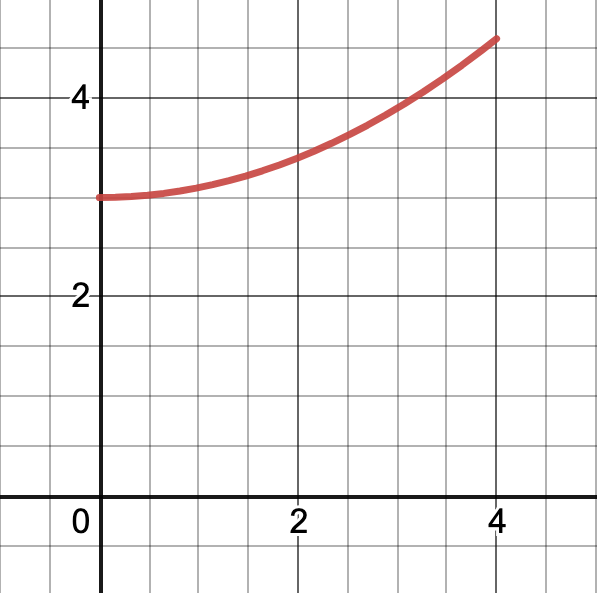

# (PART) Integration {-}

# Accumulating Change


## Activities


### Growing Bacteria

A bacteria population is growing at a rate given by 
$$f(t)=3+0.1t^2 \quad \text{  millions of bacteria per hour}$$

A plot of this growth rate is shown below.

{width=50%}

We have already estimated the change in population from $t=0$ to $t=3$ using intervals of width 1. Find a better estimate of the increase in population by

1. Using intervals of width 1/2 and evaluating $f(t)$ at the **right endpoint** of each interval. 
1. Using intervals of width 1/2 and evaluating $f(t)$ at the **left endpoint** of each interval.

You can do this by hand, or use Desmos to help out. Decide whether your value is an over-estimate or an under-estimate.


### The Change in World Population

The rate of change of the world's population, in millions of people per year, is in the table below. 


Year  | 1950 | 1960 | 1970 | 1980 | 1990 | 2000 
------+------+------+------+------+------+------
Rate of Change | 37   | 41  | 78  | 77  | 86  | 79   

Using this information, estimate the **total change** in the world's population between 1950 and 2000 by using

1. A left endpoint estimate
2. A right endpoint estimate

### Speed Tests

The velocity of a new electric car is measured every two seconds. The data is shown below.

Time (seconds) | 0 | 2 | 4 | 6 | 8   
---------------+---+---+---+---+---
Velocity (m/s) | 0 | 8 | 16.7 | 27.3 | 36.2 


Estimate the total distance traveled by this car in the first eight seconds by using

1. A left endpoint estimate
2. A right endpoint estimate


### Estimating Area with RStudio

Here is some RStudio code that will estimate the area under the curve $f(x)=2+4x^2-x^3$ on the interval $0 \leq x \leq 4$ using a **right endpoint estimation** on intervals of size $0.5$. 

```{r}
f=makeFun(2+4*x^2-x^3~x)
a=0
b=4
base = 0.5
points = seq(from=a+base, to=b, by=base)
heights = f(points)
areas = base*heights
sum(areas)
```

1. Update this code to estimate this area using
   a. A **right endpoint estimation** on intervals of size $0.1$
   b. A **right endpoint estimation** on intervals of size $0.01$
   c. A **left endpoint estimation** on intervals of size $0.5$
   d. A **left endpoint estimation** on intervals of size $0.01$
   e. A **left endpoint estimation** on intervals of size $0.00001$
  
2. Make a plot of $f(x)$ on $[0,4]$. Is is clear whether each of the values about is an over-estimate? an under-estimate? or neither?

## Solutions


### Growing Bacteria

1. Right endpoint estimate  using intervals of width 1/2. 


```{r}
f = makeFun(3+0.1*t^2~t)
# right endpoint approximation
f(0.5)*0.5 + f(1)*0.5 + f(1.5)*0.5 + f(2)*0.5 + f(2.5)*0.5 + f(3)*0.5 
```


2. Left endpoint estimate  using intervals of width 1/2.

```{r}
f = makeFun(3+0.1*t^2~t)
# left endpoint approximation
f(0)*0.5 + f(0.5)*0.5 + f(1)*0.5 + f(1.5)*0.5 + f(2)*0.5 + f(2.5)*0.5 
```


### The Change in World Population

1. Left endpoint estimate

```{r}
37*10 + 41*10 + 78*10 + 77*10 + 86*10
```


2. Right endpoint estimate

```{r}
41*10 + 78*10 + 77*10 + 86*10 + 79*10
```

### Speed Tests

1. Left endpoint estimate

```{r}
0*2 + 8*2 + 16.7*2 + 27.3*2
```

2. Right endpoint estimate

```{r}
8*2 + 16.7*2 + 27.3*2 + 36.2*2
```

### Estimating Area with RStudio


1. We estimate the area below $f(x)=2+4x^2-x^3$ on the interval $0 \leq x \leq 4$ using
   a. A **right endpoint estimation** on intervals of size $0.1$

```{r}
f=makeFun(2+4*x^2-x^3~x)
a=0
b=4
base = 0.1
points = seq(from=a+base, to=b, by=base)
heights = f(points)
areas = base*heights
sum(areas)
```   

   
   
   b. A **right endpoint estimation** on intervals of size $0.01$
   
```{r}
f=makeFun(2+4*x^2-x^3~x)
a=0
b=4
base = 0.01
points = seq(from=a+base, to=b, by=base)
heights = f(points)
areas = base*heights
sum(areas)
```    
   
   c. A **left endpoint estimation** on intervals of size $0.5$
   
```{r}
f=makeFun(2+4*x^2-x^3~x)
a=0
b=4
base = 0.5
points = seq(from=a, to=b-base, by=base)
heights = f(points)
areas = base*heights
sum(areas)
``` 

   d. A **left endpoint estimation** on intervals of size $0.01$
   
```{r}
f=makeFun(2+4*x^2-x^3~x)
a=0
b=4
base = 0.01
points = seq(from=a, to=b-base, by=base)
heights = f(points)
areas = base*heights
sum(areas)
``` 

   e. A **left endpoint estimation** on intervals of size $0.00001$
   
```{r}
f=makeFun(2+4*x^2-x^3~x)
a=0
b=4
base = 0.00001
points = seq(from=a, to=b-base, by=base)
heights = f(points)
areas = base*heights
sum(areas)
```    
  
2. Make a plot of $f(x)$ on $[0,4]$. Is is clear whether each of the values about is an over-estimate? an under-estimate? or neither?


```{r}
f=makeFun(2+4*x^2-x^3~x)
plotFun(f(x)~x, xlim=c(0,4))
``` 

It is **not** clear whether any of these values is an over-estimate or an under-estimate. There is a maximum at $x=2.75$. 

* A left endpoint estimate will be an under-estimate on $[0,2.75]$ and an over-estimate on $[2.75,4]$.
* A right endpoint estimate will be an over-estimate on $[0,2.75]$ and an under-estimate on $[2.75,4]$.

So we can't easily tell whether it's an under-estimate or an over-estimate.

