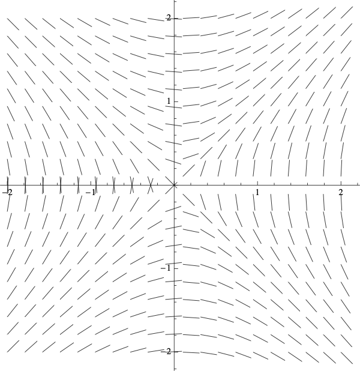
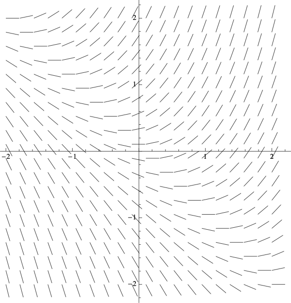
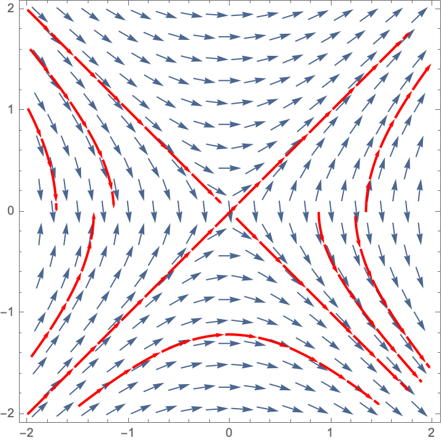
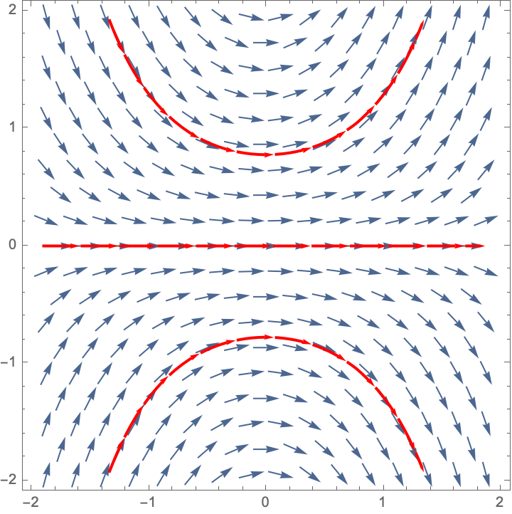
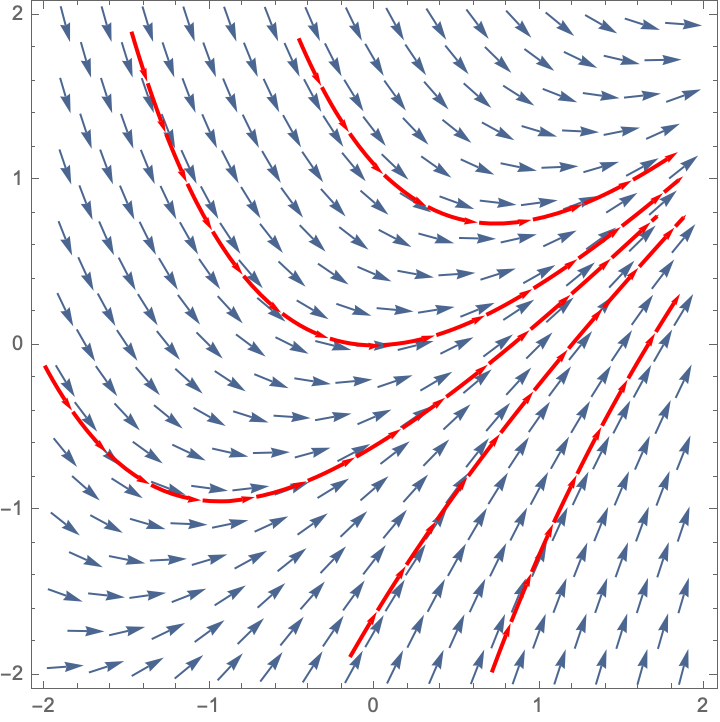
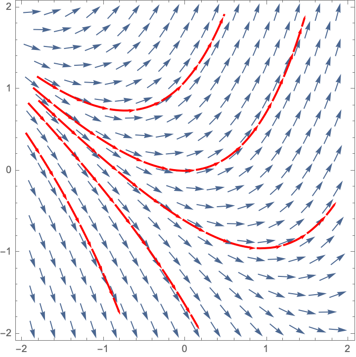

# Slope Fields

## Creating a Slope Field in RStudio

The `mosaicCalc` package has a `vectorfield_plot` function that we use to create a slope field. So we need to make sure that this package has been loaded into RStudio.

```{r}
suppressPackageStartupMessages(library(mosaicCalc))
```

Here is the code to create the slope field for $\displaystyle{\frac{dP}{dt} = 6 - 2 P}$


```{r}
vectorfield_plot(t ~ 1,
P ~ 6 - 2 * P,
bounds(t=-8:8, P=-8:8))
```

## Activities


### Match the Slope Field


Match each of the following differential equations with its slope field. *Hint:* start by setting $\frac{dy}{dx} = 0$ and solving for $y$. The slopes along the resulting curve will always be horizontal.


1. $\displaystyle{\frac{dy}{dx}=xy}$
1. $\displaystyle{\frac{dy}{dx}=\frac{x}{y}}$
1. $\displaystyle{\frac{dy}{dx}=x+y}$
1. $\displaystyle{\frac{dy}{dx}=x-y}$

<table>
<tr>
<td> Slope Field A</td>
<td> Slope Field B</td>
</tr>
<tr>
<td>
{width=100%}
</td>
<td>
{width=100%}
<tr>
<td></td>
<td></td>
</tr>
<tr>
<td> Slope Field C</td>
<td> Slope Field D</td>
</tr>
</td>
</tr>
<tr>
<td>
{width=100%}
</td>
<td>
{width=100%}
</td>
</tr>
</table>

### Draw Some Trajectories

For each of the above slope fields, sketch the solution curves that satisfy

1. $y(0) = 1$
1. $y(0) = 0$
1. $y(0) = -1$


### Slope Fields for Population Models

Create a slope field for each of the following population models. For each one, describe the long-term behavior for a variety of intial populations. For which initial values of $P$ does the population increase without bound? stabilize to a constant value? die out? 

1. Exponential growth with harvesting.
$$
\frac{dP}{dt} = 0.2 P - 40
$$
for  $0 \leq P \leq 300$ and $0 \leq t \leq 100$.


2. Constrained growth
$$
\frac{dP}{dt} = 0.05 P  (1 - 0.002 P) 
$$
for  $0 \leq P \leq 600$ and $0 \leq t \leq 50$.


3. Constrained growth with constant harvesting
$$
\frac{dP}{dt} = 0.05 P  (1 - 0.002 P) - 4
$$
for  $0 \leq P \leq 600$ and $0 \leq t \leq 50$.

## Solutions

### Match the Slope Fields

1. $\displaystyle{\frac{dy}{dx}=xy}$ is Slope Field B 
1. $\displaystyle{\frac{dy}{dx}=\frac{x}{y}}$ is Slope Field A
1. $\displaystyle{\frac{dy}{dx}=x+y}$ is Slope Field D
1. $\displaystyle{\frac{dy}{dx}=x-y}$ is Slope Field C

### Draw Some Trajectories

Here are some trajectories (not necessarily the ones that go through the three points specified).

<table>
<tr>
<td> Slope Field A</td>
<td> Slope Field B</td>
</tr>
<tr>
<td>
{width=100%}
</td>
<td>
{width=100%}
<tr>
<td></td>
<td></td>
</tr>
<tr>
<td> Slope Field C</td>
<td> Slope Field D</td>
</tr>
</td>
</tr>
<tr>
<td>
{width=100%}
</td>
<td>
{width=100%}
</td>
</tr>
</table>


### Slope Fields for Population Models

Create a slope field for each of the following population models. For each one, describe the long-term behavior for a variety of intial populations. For which initial values of $P$ does the population increase without bound? stabilize to a constant value? die out? 

1. Exponential growth with harvesting.

```{r, out.width="70%"}
vectorfield_plot(t ~ 1,
P ~  0.2 * P -  40,
bounds(t=0:100, P=0:300))
```

* If $P(0) > 200$ then the population increases without bound
* If $P(0) = 200$ then the population remains at this equilibrium value. This is an unstable equilibrium.
* If $P(0) < 200$ then the population decreases to zero.

2. Constrained growth

```{r, out.width="70%"}
vectorfield_plot(t ~ 1,
P ~  0.05  * P *  (1 - 0.002 * P),
bounds(t=0:50, P=0:600))
```

* If $P(0) = 0$ then the population remains at 0. This is an unstable equilibrium.
* If $0 < P(0) < 500$ then the population increases to the carrying capacity 500.
* If $P(0) = 500$ then the population remains at this equilibrium value. This is a stable equilibrium, and it is the carrying capacity.
* If $P(0) > 500$ then the population decreases down to the carrying capacity 500.


3. Constrained growth with constant harvesting


```{r, out.width="70%"}
vectorfield_plot(t ~ 1,
P ~  0.05  * P *  (1 - 0.002 * P) - 4,
bounds(t=0:50, P=0:600))
```

Let's set $\frac{dP}{dt}=0$ and solve to find the equilibrium points. We have
\begin{align}
-0.0001 P^2 + 0.05 P   - 4 &= 0 \\
 P^2 - 500 P   + 40000 &= 0 \\
 (P-100)(P-400) &= 0
\end{align}

* If $P(0) < 100$ then the population decreases to 0  at 0.
* If $P(0) = 100$ then the population remains at 100. This is an unstable equilibrium.
* If $100 < P(0) < 400$ then the population increases to 400.
* If $P(0) = 400$ then the population remains at this equilibrium value. This is a stable equilibrium.
* If $P(0) > 400$ then the population decreases down to 400.