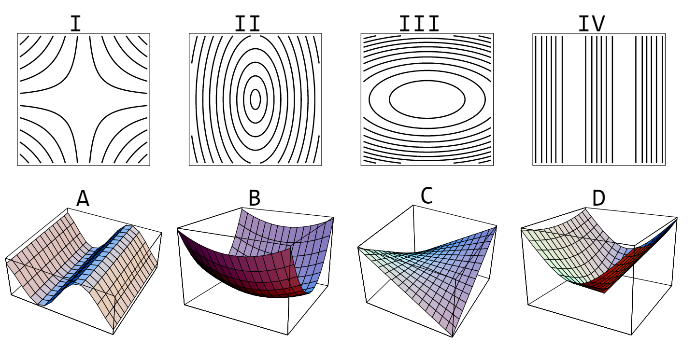

--- 
title: "MATH 135: AMC I"
site: bookdown::bookdown_site
output:
  bookdown::gitbook:
    config:
      sharing:
        facebook: false
        twitter: false
documentclass: book
link-citations: yes
github-repo: mathbeveridge/math135_f21
description: "This is the class activity manual for MATH 135 at Macalester College."
header-includes:
  - \usepackage{pgf}
  - \usepackage{pgfplots}
---

# Preface {-}

Placeholder


<!--chapter:end:index.Rmd-->


# R Studio Orientation

Placeholder


## Getting Oriented
### First login
### The RStudio window
####  Panels
#### Specific functions
#### Command Line Console
### Packages
## RMarkdown
## Calculations in RStudio
### Basic Commands
#### Arithmetic
#### Exponentials and Logarithms
### Variables
### Lists and sequences
### Making functions
## Data
### Importing data from RStudio/mosaic
### Importing .csv files
## Plots 
### Single variable plots
### Multivariable plots
### Plotting data

<!--chapter:end:Unit0-R_Primer.Rmd-->


# RStudio Quick Referrence

Placeholder


## Functions and Data    
### Common Functions
### Defining Your Own Function
### Creating Lists of Data
### Plotting Data
### Plotting Functions
### Plotting Data and Functions
### Fitting a Function to Data
#### Fitting a Power Function to Data
#### Fitting a Model by Specifying Starting Values
### Plotting Surfaces in 3D
## Differentiaation
### Estimating the Derivative
### Estimating the Partial Derivative
### Gradient Search
### Constrained Optimization
## Integration 
### Estimating the Definite Integral
## Differential Equations
### Euler's Method
### Slope Fields
### SIR Model
## Troubleshooting

<!--chapter:end:Unit0-R_QuickRef.Rmd-->


# Intro to RStudio

Placeholder


## Getting Started
## R Markdown files
### Formatting Regular Text
### Code Chunks
## Writing Code
### Basic Calculations
#### You Try
### Variables, Lists and Sequences
#### You Try
### Functions
#### You Try
### Plotting
#### You Try
## Troubleshooting
### You Try 

<!--chapter:end:Unit0-R_Intro.Rmd-->


# (PART) Functions {-}
# Functions

Placeholder


## Steps of the Modeling Cycle
## Goals
## Activities
### Life insurance 
### Bat species
### Slope and concavity
### Relative change of the Dow Jones average 
### Measuring rainfall

<!--chapter:end:Unit1-Functions.Rmd-->


# Linear Functions

Placeholder


## Goals
## Linear Funtions
## Activities
### Graph of a linear function
### Height and weight of American men
### Scooter rates
### Oil reserves
### World population growth rate
## Solutions
### Graph of a linear function
### Height and weight of American men
### Scooter rates
### Oil reserves

<!--chapter:end:Unit1-LinearFunctions.Rmd-->


# Average Rate of Change

Placeholder


## Goals
## Activities
### AROC of a function
### Measuring daily rainfall
### Sketching a function
### Slope and Concavity
### Example Function
### Vinyl LPs
### Relative change of the Dow Jones average 
## Solutions
### AROC of a function
### Measuring daily rainfall
### Sketching a function
### Slope and Concavity
### Example Function
### Vinyl LPs
### Relative change of the Dow Jones average 

<!--chapter:end:Unit1-RateOfChange.Rmd-->


# Exponential and Logarithmic Functions

Placeholder


## Goals
## Activities
### Growing population
### Consumer price index
### Two data sets
### Interest rate for an investment
### Exponential decay
### Doubling time
### People and vehicles
## Solutions
### Growing population
### Consumer price index
### Two data sets
### Interest rate for an investment
### Exponential decay
### Doubling time
### People and vehicles

<!--chapter:end:Unit1-Exp.Rmd-->


# Power Functions

Placeholder


## Goals
## Activities
### Examples and non-examples
### Descriptions of power functions
### Allometry of pectoral fins
### Specific heat
## Solutions
### Examples and non-examples
### Descriptions of power functions
### Allometry of pectoral fins
### Specific heat

<!--chapter:end:Unit1-Power.Rmd-->


# Periodic Functions

Placeholder


##  Goals
##  Activities
### Periodic function examples
### Find a periodic formula
### Variable star
### Tides and currents
### Rainfall in Seattle
## Solutions
### Periodic function examples
### Find a periodic formula
### Variable star
### Tides and currents
### Rainfall in Seattle

<!--chapter:end:Unit1-Periodic.Rmd-->

# Multivariable Functions

```{r, include=FALSE, warning=FALSE}
knitr::opts_chunk$set(echo = TRUE)
suppressPackageStartupMessages(library(mosaic))
```

## Goals

* Identify and explain independent and dependent variables in
multivariable functions
* Interpret functions represented as tables and equations
* Interpret contour diagrams and make function value estimates
* Interpret cross sections and connect them with contour
diagrams
* Use RStudio to create a contour plot and a surface plot of a function $z=f(x,y)$.

## Activities

```{r setup, include=FALSE, warning=FALSE}
knitr::opts_chunk$set(echo = TRUE)
suppressPackageStartupMessages(library(mosaic))
```

### Matching Contours

Match contours I - IV to surfaces A - D.

{width=80%}
<!--
## Drawing contours on a data table
-->


### Plotting in RStudio

Create these plots using RStudio. 

You will need to import the mosaic package. Cut and paste this code chunk into your RMD file and run it. This will load in the `plotFun` command to create surface plots and contour plots. 

````
```{r setup, include=FALSE, warning=FALSE}`r ''`
knitr::opts_chunk$set(echo = TRUE)
suppressPackageStartupMessages(library(mosaic))
```
````


1. Windchill Function

$$
W(T,V) = 35.74+0.6215 \, T-35.75 \, V^{0.16}+0.4275 \, T \,  V^{0.16}
$$ 

Surface plot

```{r}
W = makeFun(35.74+0.6215*T-35.75*V^(0.16)+0.4275*T*V^(0.16) ~ T & V)

plotFun(W(T,V)~T & V, 
        T.lim=range(-30,30),
        V.lim=range(5,40),
        surface=TRUE,
        zlab="W",
        xlab="T",
        ylab="V")
```

Contour Plot

```{r}
plotFun(W(T,V) ~ T & V, 
        T.lim=range(-40,40), 
        filled=FALSE,
        V.lim=range(5,60),
        zlab="V",
        xlab="T",
        ylab="V", 
        levels = seq(-100,40,10))
```


2. Another Function

$$
f(x,y) = \frac{\sin(x^2+y^2)}{0.1+x^2+y^2}+ \frac{1}{2}(x^2+4y^2)e^{1-x^2-y^2}
$$
Surface Plot

```{r}
f = makeFun(sin(x^2+y^2)/(0.1+x^2+y^2)+(x^2+4*y^2)*exp(1-x^2-y^2)/2~ x & y)

plotFun(f(x,y) ~ x & y,
        surface=TRUE,
        zlab="f(x,y)",
        x.lim=range(-3,3),
        y.lim=range(-3,3))
```

Contour Plot

```{r}
plotFun(f(x,y)~ x & y,
        filled=FALSE,
        zlab="f(x,y)",
        x.lim=range(-3,3),
        y.lim=range(-3,3))
```


### Cross Sections

For each of the the two functions in the previous problem:

* Sketch two or three horizontal cross sections
* Sketch two or three vertical cross sections
* Then use RStudio to create these cross sections and compare to your sketches. How well did you do?


### Plotting in RStudio

Here is some sample RStudio code that defines a function `P(x,y) = x^2 - 4x y^3` and then creates two contour plots. The first plot uses the default domain and default level curves (chosen by RStudio). The second plot specifies both of these using additional arguments. 

```{r}
P = makeFun(x^2 - 4*x*y^3 ~ x&y)

plotFun(P(x,y) ~ x&y, filled=FALSE)

plotFun(P(x,y) ~ x&y, 
        filled=FALSE, 
        x.lim=range(-5,5),
        y.lim=range(-5,5), 
        levels = seq(-1000, 1000, 200))

```


Using RStudio,

* Use `makeFun` to create each of these functions. 
* Then use `plotFun` to create a contour plot.

Try out different horizontal and vertical domains that are centered around the origin. Change the level curves.


1. $f(x,y) = \sin(\sqrt{x^2+y^2})$
2. $g(x,y) = 100 x^2 y^2 e^{-x^2-y^2}$
3. $h(x,y) = \sin^2x + \frac{1}{4}y^2$ 


## Solutions


### Matching Contours


1. C
2. B
3. D
4. A


### Plotting in RStudio


The expected plots are shown in the question.


### Cross Sections

1. Here are some cross sections for the windchill function
$$W(T,V) = 35.74+0.6215 \, T-35.75 \, V^{0.16}+0.4275 \, T \,  V^{0.16}$$

```{r}
W = makeFun(35.74+0.6215*T-35.75*V^(0.16)+0.4275*T*V^(0.16)~T & V)

plotFun(W(T,20) ~ T, 
        T.lim = range(-40,40), 
        xlab = "T",
        ylab = "W",  
        main = "Windchill for V=20",
        levels = seq(-100,40,10))

plotFun(W(T,40) ~ T, 
        T.lim = range(-40,40), 
        xlab = "T",
        ylab = "W",  
        main = "Windchill for V=40",
        levels = seq(-100,40,10))

```


```{r}
plotFun(W(-20,V) ~ V, 
        V.lim=range(0,60), 
        xlab="V",
        ylab="W",  
        main="Windchill for T=-20")

plotFun(W(20,V) ~ V, 
        V.lim=range(0,60), 
        xlab="V",
        ylab="W",  
        main="Windchill for T=20")

```


2. Here are some cross sections for the second function.
$$
f(x,y) = \frac{\sin(x^2+y^2)}{0.1+x^2+y^2}+ \frac{1}{2}(x^2+4y^2)e^{1-x^2-y^2}
$$


```{r}
f = makeFun(sin(x^2 + y^2)/(0.1 + x^2 + y^2) + (x^2 + 4*y^2) * exp(1 - x^ 2- y^2)/2 ~ x & y)
```

```{r}
plotFun(f(x,-1.5) ~ x, x.lim=range(-1,1))
plotFun(f(x,0) ~ x, x.lim=range(-1,1))
plotFun(f(x,1.5) ~ x, x.lim=range(-1,1))
```
```{r}
plotFun(f(-1.5,y) ~ y, y.lim=range(-1,1))
plotFun(f(0,y) ~ y, y.lim=range(-1,1))
plotFun(f(1.5,y) ~ y, y.lim=range(-1,1))
```


### Plotting in RStudio

1. $f(x,y) = \sin(\sqrt{x^2+y^2})$


```{r}
f = makeFun(sin( sqrt((x^2+y^2))) ~ x&y)

plotFun(f(x,y) ~ x & y, 
        filled=FALSE, 
        x.lim=range(-3,3),
        y.lim=range(-3,3), 
        levels = seq(0, 1, 0.25))

```


2. $g(x,y) = x^2 y^2 e^{-x^2-y^2}$

```{r}
g = makeFun(100 * x^2 *  y^2 * exp(-x^2-y^2)~ x&y)

plotFun(g(x,y) ~ x & y, 
        filled=FALSE, 
        x.lim=range(-2,2), 
        y.lim=range(-2,2), 
        levels=seq(0,15,3))

```


3. $h(x,y) = \sin^2x + \frac{1}{4}y^2$ 


```{r}
g = makeFun((sin(x))^2 + y^2/4 ~ x&y)

plotFun(g(x,y) ~ x & y, 
        filled=FALSE, 
        x.lim=range(-5,5), 
        y.lim=range(-3,3), 
        levels=seq(0,4,0.5))

```


<!--

Draw contours for $g(x,y)=k$ on the given table for $k=3,6,9$.

\begin{tikzpicture}
\node at (0,0) {
\begin{tabular}{|c|c|c|c|c|c|c|c|c|c|} \hline
\cellcolor{gray} g & \cellcolor{gray} 0 & \cellcolor{gray} 10 & \cellcolor{gray} 20 & \cellcolor{gray} 30 & \cellcolor{gray} 40 & \cellcolor{gray} 50 & \cellcolor{gray} 60 & \cellcolor{gray} 70 & \cellcolor{gray} 80 \\ 
\cellcolor{gray} 80 & 2 & 3 & 4 & 6 & 6 & 7 & 7 & 6 & 6 \\ \hline
\cellcolor{gray} 70 & 3 & 4 & 5 & 6 & 8 & 8 & 8 & 8 & 7 \\ \hline
\cellcolor{gray} 60 & 4 & 5 & 6 & 8 & 9 & 10 & 9 & 9 & 8 \\ \hline
\cellcolor{gray} 50 & 3 & 4 & 5 & 7 & 8 & 9 & 9 & 8 & 7 \\ \hline
\cellcolor{gray} 40 & 2 & 3 & 4 & 5 & 7 & 8 & 8 & 7 & 6 \\ \hline
\cellcolor{gray} 30 & 1 & 2 & 3 & 5 & 6 & 7 & 6 & 6 & 5 \\ \hline
\cellcolor{gray} 20 & 0 & 1 & 2 & 4 & 5 & 6 & 5 & 5 & 4 \\ \hline
\cellcolor{gray} 10 & 0 & 0 & 1 & 3 & 4 & 4 & 4 & 3 & 2 \\ \hline
\cellcolor{gray} 0 & -1 & -1 & 0 & 2 & 3 & 3 & 2 & 2 & 1 \\ \hline
\end{tabular}
};
\end{tikzpicture}
-->

<!--chapter:end:Unit1-Multivariable.Rmd-->


# Unit 1 Summary

Placeholder


## Functions
## Linear Functions
## Average Rate of Change
## Exponential and Logarithmic Functions
## Power Functions
## Periodic Functions
## Multivariable Functions

<!--chapter:end:Unit1-Summary.Rmd-->


# (PART) Units and Estimation {-}
# Dimensions and Units

Placeholder


## Activities
### Find the Dimension
### Dimensionally Feasible
### Geometric Formulas for a Cylinder
### Unit Conversions
## Solutions
### Find the Dimension
### Dimensionally Feasible
### Geometric Formulas for a Cylinder
### Unit Conversions

<!--chapter:end:Unit2-Dimension.Rmd-->


# Dimensional Analysis

Placeholder


## Performing a Dimensional Analysis
## Activities
### Vocal Chord Frequency
### Mixer Power
### Velocity of an Ocean Wave
## Solutions

<!--chapter:end:Unit2-DimensionalAnalysis.Rmd-->


# Fermi Estimation

Placeholder


## Working Fermi Problems
## Some Useful Data
## Activities
## Solutions

<!--chapter:end:Unit2-FermiEstimation.Rmd-->

# Unit 2 Summary


## Dimensions and Units

I can ...

* Explain the difference between dimensions and units
* Identify the seven fundamental dimensions
* Look up the dimensions for various physical quantities such as velocity, acceleration and force.
* Find the dimension for a given formula
* Perform a unit conversion

## Dimensional Analysis

I can ...

* Determine whether an equation is dimensionally feasible (consistent) or dimensionally infeasible (inconsistent)
* Perform a dimensional analysis to guess the formula for a physical system, given the inputs and the output.

## Fermi Estimation

I can ...

* Find the order of magnitude of a number
* Estimate the order of magnitude of a simple quantity 
* Explain why 300 is a good choice to estimate a magnitude that is definitely bigger than 100 but less than 1000 
* Make a Fermi Estimation of a complicated quantity by making a sequence of simpler estimations.

<!--chapter:end:Unit2-Summary.Rmd-->


# (PART) Computational Derivatives {-}
# The Derivative

Placeholder


## The Derivative
## Activities
### Studying
### Marginal Cost
### Farmland in the United States
### A Moving Particle
## Solutions
### Studying
### Marginal Cost
### Farmland in the United States
### A Moving Particle

<!--chapter:end:Unit3-DerivIntro.Rmd-->


# The Second Derivative

Placeholder


## Interpreting the First and Second Derivative
## Activities
### Estimating the first and second derivatives from a graph
### Function Matching
### A Plot of Velocity
### Characterize the Derivatives
## Solutions
### Estimating the first and second derivatives from a graph
### Function Matching
### A Plot of Velocity
### Characterize the Derivatives

<!--chapter:end:Unit3-SecondDeriv.Rmd-->


# Partial Derivatives

Placeholder


## Activities
### Estimating From Data
### Estimating From a Contour Plot
### Estimating Using Desmos
## Solutions
### Estimating From Data
### Estimating From a Contour Plot
### Estimating Using Desmos

<!--chapter:end:Unit3-PartialDeriv.Rmd-->


# Local Linear Approximation

Placeholder


## Activities
### Estimating Sugar Solution Temperature
### Comparing Linearizations
### Estimating a Function
### Estimating the Windchill
## Solutions
### Estimating Sugar Solution Temperature
### Comparing Linearizations
### Estimating a Function
### Estimating the Windchill

<!--chapter:end:Unit3-Linearization.Rmd-->


# Unit 3 Summary

Placeholder


## The Derivative
## The Second Derivative
## Partial Derivatives
## Local Linear Approximation

<!--chapter:end:Unit3-Summary.Rmd-->


# (PART) Symbolic Derivatives {-}
# Rules of Differentiation

Placeholder


## Derivatives of Familiar Functions
### Constant Rule
### Linear Function Rule
### Power Rule
### Trig Rules
### Exponential Rules
### Logarithmic Rules
## Arithmetic Rules for Derivatives
### Constant Multiple Rule
### Sum and Difference Rules  
## Rules for Combinations of Functions
### Product Rule
### Quotient Rule
### Chain Rule 

<!--chapter:end:Unit4-DerivativeRules.Rmd-->


# Symbolic Differentiation

Placeholder


## Activities
### Basic Derivative Practice
### More Basic Derivative Practice
### Product Rule and Quotient Rule Practice
## Solutions
### Basic Derivative Practice
### More Basic Derivative Practice 
### Product Rule and Quotient Rule Practice

<!--chapter:end:Unit4-Differentiation.Rmd-->


# The Chain Rule

Placeholder


## Activities
### Chain Rule Practice
### More Chain Rule Practice
### Conceptual Chain Rule Problems 
### Visual Chain Rule Problem
## Solutions
### Chain Rule Practice
### More Chain Rule Practice
### Conceptual Chain Rule Problems 
### Visual Chain Rule Problem

<!--chapter:end:Unit4-ChainRule.Rmd-->


# The Gradient

Placeholder


## Activities
### Partial Derivative Practice
### Second Partial Derivative Practice
### Gradient Practice
### Gradient on a Contour Diagram
### Gradient and the Direction of Greatest Increase
## Solutions
### Partial Derivative Practice
### Second Partial Derivative Practice
### Gradient Practice
### Gradient on a Contour Diagram
### Gradient and the Direction of Greatest Increase

<!--chapter:end:Unit4-PartialGradient.Rmd-->


# Unit 4 Summary

Placeholder


## Symbolic Derivatives
## Partial Derivatives
## The Gradient

<!--chapter:end:Unit4-Summary.Rmd-->


# (PART) Optimization {-}
# 1D Optimization

Placeholder


## Activities
### Characterize the Extrema
### First Derivative Test
### Second Derivative Test
### Cupcake Store
## Solutions
### Characterize the Extrema
### First Derivative Test
### Second Derivative Test
### Cupcake Store

<!--chapter:end:Unit5-Optimization1D.Rmd-->


# 2D Optimization

Placeholder


## Summary
## Activities
### Characterize the Extrema
### Classifying a critical point using a small circle of values
### The 2D Second Derivative Test
### Classify the Critical Points
### Optimizing Flight Control
## Solutions
### Characterize the Extrema
### Classifying a critical point using a small circle of values
### The 2D Second Derivative Test
### Classify the Critical Points
### Optimizing Flight Control

<!--chapter:end:Unit5-Optimization2D.Rmd-->


# Gradient Search

Placeholder


## Gradient Search Example
## Activities
### Finding a Local Minimum
## Solutions
### Finding a Local Minimum

<!--chapter:end:Unit5-GradientSearch.Rmd-->


# Constrained 2D Optimization

Placeholder


## Creating a Contour Plot for 2D Optimization
## Activities
### Constrained Production
### Constrained Optimization on a Circle
### Estimating the Lagrange Multiplier
## Solutions
### Constrained Production
### Constrained Optimization on a Circle
### Estimating the Lagrange Multiplier

<!--chapter:end:Unit5-ConstrainedOptimization.Rmd-->


# Unit 5 Summary

Placeholder


## 1D Optimization
## 2D Optimization
## Gradient Search
## Constrained Optimization

<!--chapter:end:Unit5-Summary.Rmd-->


# (PART) Integration {-}
# Accumulating Change

Placeholder


## Activities
### Growing Bacteria
### The Change in World Population
### Speed Tests
### Estimating Area with RStudio
## Solutions
### Growing Bacteria
### The Change in World Population
### Speed Tests
### Estimating Area with RStudio

<!--chapter:end:Unit6-AccumulatingChange.Rmd-->


# The Definite Integral

Placeholder


## Introduction
## Activities
### Drive My Car
### Accelerate My Car
### Making Cupcakes
### Area Between Curves
## Solutions
### Drive My Car
### Accelerate My Car
### Making Cupcakes
### Area Between Curves

<!--chapter:end:Unit6-DefiniteIntegral.Rmd-->


# Rules of Integration

Placeholder


## The Fundamental Theorem of Calculus
## Integrals of Familiar Functions
### Constant Rule
### Power Rules
### Trig Rules
### Exponential Rules
### Logarithmic Rules
## Arithmetic Rules for Integrals
### Constant Multiple Rule
### Sum and Difference Rules  
### Substitution Rule
## Rules for Endpoints
### Decomposition Rule
### Zero Integral Rule

<!--chapter:end:Unit6-IntegrationRules.Rmd-->


# The Indefinite Integral

Placeholder


## Activities
### Indefinite Integral Practice
### Definite Integral Practice
### Area Between Curves
### Average Value
### Modeling Population Growth
### Zombie Apocalypse
## Solutions
### Indefinite Integral Practice
### Definite Integral Practice
### Area Between Curves
### Average Value
### Modeling Population Growth
### Zombie Apocalypse

<!--chapter:end:Unit6-IndefiniteIntegral.Rmd-->


# Unit 6 Summary

Placeholder


## Accumulating Change
## The Definite Integral
## The Indefinite Integral

<!--chapter:end:Unit6-Summary.Rmd-->


# (PART) Differential Equations {-}
# Modeling Change

Placeholder


## Activities
### Building Differential Equations
### Solve the Differential Equation
### Verifying Solutions to Differential Equations
## Solutions
### Building Differential Equations
### Solve the Differential Equation
### Verifying Solutions to Differential Equations

<!--chapter:end:Unit7-DiffEq.Rmd-->


# Population Models

Placeholder


## Important Models
### Exponential Growth/Decay
### Exponential Growth/Decay with Constant Input/Output
### Constrained Growth
### Newton's Law of Cooling
## Activities
### Drug Metabolization
### Elementary, My Dear Watson
### Optimal Coffee Temperature
### Constrained Rabbit Population
### Constrained Deer Population
## Solutions
### Drug Metabolization
### Elementary, My Dear Watson
### Optimal Coffee Temperature
### Constrained Rabbit Population
### Constrained Deer Population

<!--chapter:end:Unit7-PopModels.Rmd-->


# Euler's  Method

Placeholder


## Introduction
### Euler's Method in RStudio
##  Activities
### Euler's Method for Two Steps
### Calculating an Euler Approximation
### Estimating Drug Metabolization
### Euler's Method with Different Step Sizes
##  Soluutions
### Euler's Method for Two Steps
### Calculating an Euler Approximation
### Estimating Drug Metabolization
### Euler's Method with Different Step Sizes

<!--chapter:end:Unit7-EulersMethod.Rmd-->


# Slope Fields

Placeholder


## Creating a Slope Field in RStudio
## Activities
### Match the Slope Field
### Draw Some Trajectories
### Slope Fields for Population Models
## Solutions
### Match the Slope Fields
### Draw Some Trajectories
### Slope Fields for Population Models

<!--chapter:end:Unit7-SlopeFields.Rmd-->


# SIR Model

Placeholder


## The SIR Model for the Spread of Disease
### Plotting an SIR Slope Field and an SIR Trajectory
## Activities
### Threshold Population for an SIR Model
### Ending an Outbreak Before Everyone Gets Sick
### Managing an Outbreak
### Changing Infection Rate Versus Changing Removal Rate
## Solutions
### Threshold Population for an SIR Model
### Ending an Outbreak Before Everyone Gets Sick
### Managing an Outbreak
### Changing Infection Rate Versus Changing Removal Rate

<!--chapter:end:Unit7-SpreadOfDisease.Rmd-->


# Unit 7 Summary

Placeholder


## Differential Equations
##  Population Models
## Euler's Method
## Slope Fields
## SIR Model

<!--chapter:end:Unit7-Summary.Rmd-->

